# LAB 1 - Administración de identidades de Azure Active Directory

Para que los usuarios se puedan autentificar usando Azure AD, debes proveerles con sus usuarios y grupos. La membresía de los grupos debes ser actualizadas automáticamente dependiendo del título de trabajo. Crear un Azure AD tenant con un usuario y darle permisos limitados a los recursos del principal.

Proyecto: 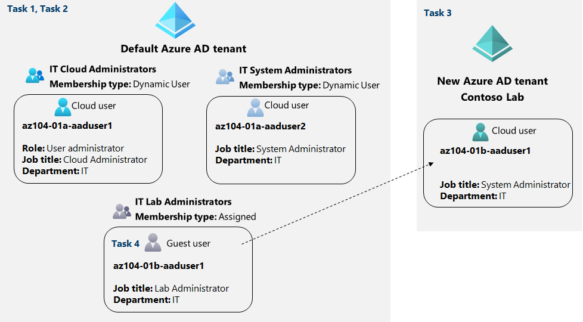

• Tarea 1: Crear y configurar usuarios en Azure AD.

1- Conectarse a [azure portal](https://portal.azure.com/?l=en.en-us#home).

2- En el portal de azure, buscar y seleccionar Azure Active Directory.

3- En el panel del Azure AD, busca la sección de Manage, dentro de Users y muestra las opciones de configuración.

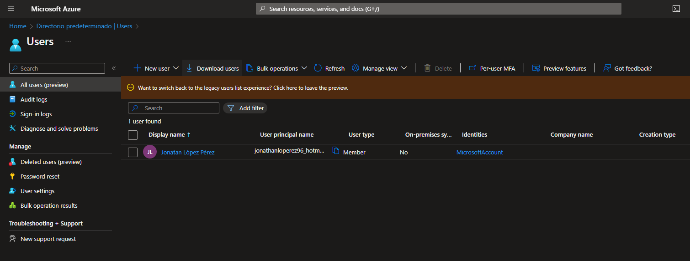

4- Muestra la configuración de perfil de tu cuenta.

5- Edita y cambia el Usage Location a United States y guarda el cambio.

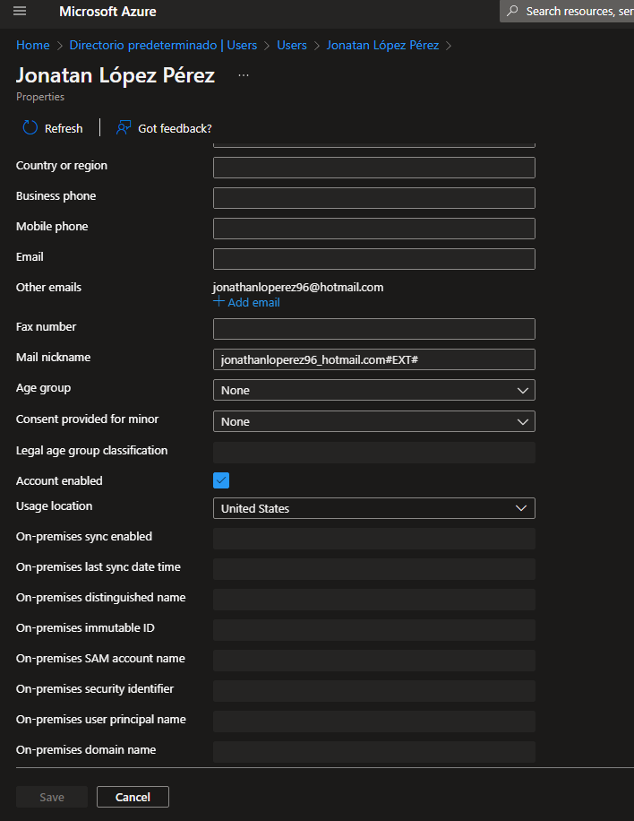

6- Vuelve a Users y crea un nuevo usuario con los siguientes parámetros:

| Setting                    | Value                     |
|----------------------------|---------------------------|
| User name                  | az104-01a-aaduser1        |
| Name                       | az104-01a-aaduser1        |
| Let me create the password | enabled                   |
| Initial password           | Provide a secure password |
| Usage location             | United States             |
| Job title                  | Cloud Administrator       |
| Department                 | IT                        |

7- Añade el rol de User Administrator de Azure AD en el nuevo usuario creado.

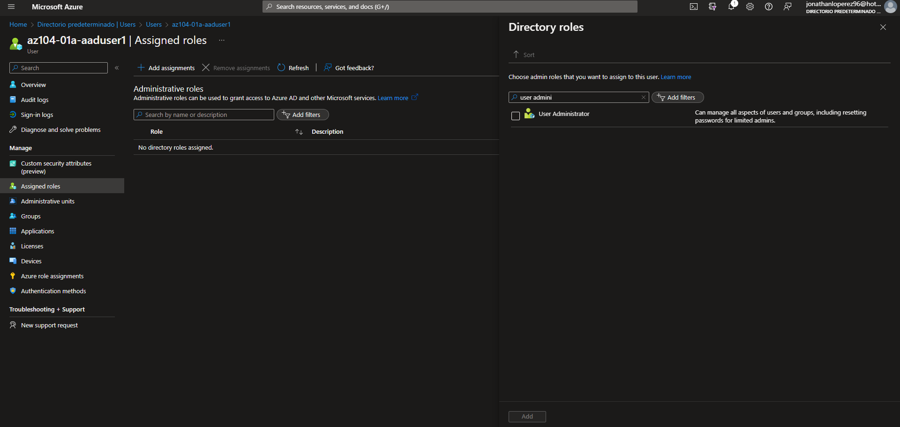

8- Conecta al portal de azure con el usuario anteriormente creado y entra al Azure AD.

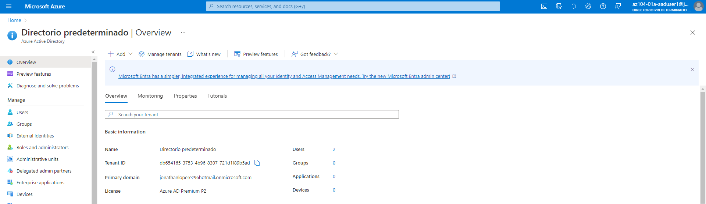

9- Con el usuario creado, crea un nuevo usuario con las siguientes parámetros:

| Setting                    | Value                     |
|----------------------------|---------------------------|
| User name                  | az104-01a-aaduser2        |
| Name                       | az104-01a-aaduser2        |
| Let me create the password | enabled                   |
| Initial password           | Provide a secure password |
| Usage location             | United States             |
| Job title                  | System Administrator      |
| Department                 | IT                        |

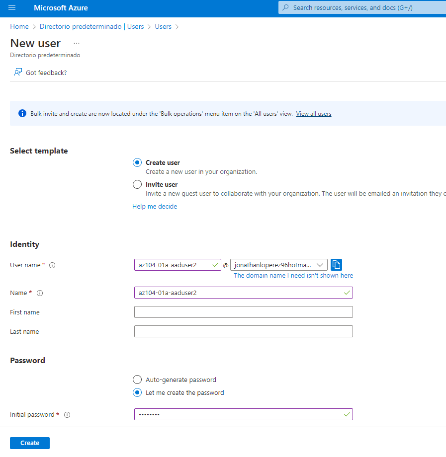

10- Cierra la sesión.

• Tarea 2: Crear grupos de Azure AD con membresía asignada y dinámica.

1- En el panel de Azure AD, busca y entra en Licenses.

2- Dentro de la sección de Manage, en All Products, activa Azure AD premium P2. (Para que se actualicen las membresías automáticamente)

> Puede tardar un rato en activarse.

3- Volvamos a Azure AD, y dentro de Groups, creamos uno nuevo con los siguientes parámetros:

| Setting           | Value                           |
|-------------------|---------------------------------|
| Group type        | Security                        |
| Group name        | IT Cloud Administrators         |
| Group description | Contoso IT cloud administrators |
| Membership type   | Dynamic User                    |

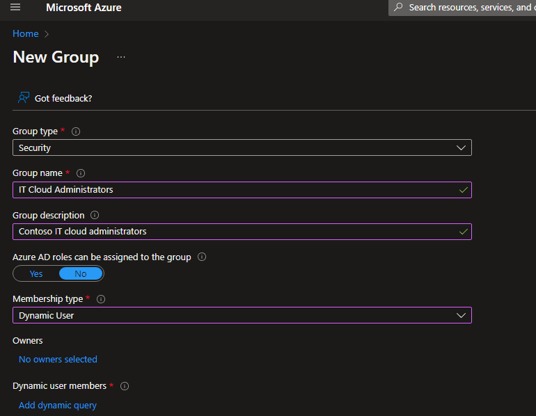

4- Añadimos una regla en Add dynamic query que indique, jobtitle sea igual a Cloud Administrator.

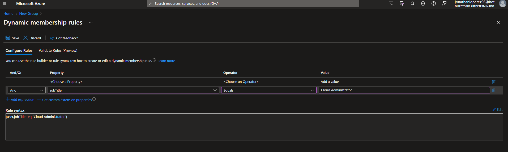

• Tarea 3: Crear un Azure Active Directory (AD) tenant.

1- En el portal de Azure, busque y seleccione Azure Active Directory.

2- Haga clic en Administrar inquilinos y, a continuación, en la siguiente pantalla, haga clic en + Crear y especifique la siguiente configuración:

| Setting        | Value                  |
|----------------|------------------------|
| Directory type | Azure Active Directory |

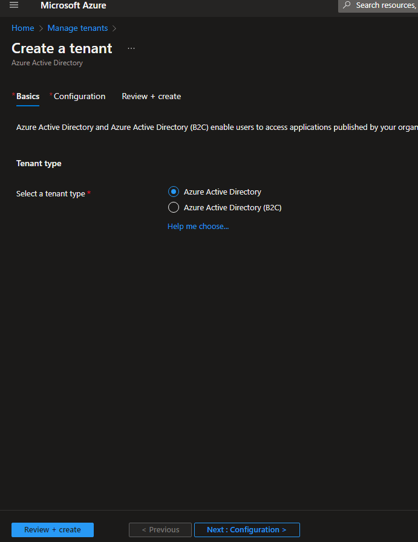

3- Haga clic en Siguiente : Configuración

| Setting             | Value                                                                                     |
|---------------------|-------------------------------------------------------------------------------------------|
| Organization name   | Contoso Lab                                                                               |
| Initial domain name | any valid DNS name consisting of lower case letters and digits and starting with a letter |
| Country/Region      | United States                                                                             |

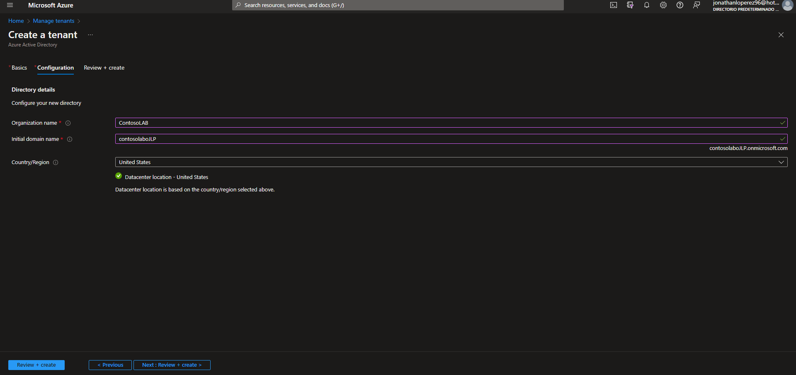

4- Haga clic en Revisar + crear y, a continuación, haga clic en Crear.

5- Visualice la hoja del tenant Azure AD recién creado utilizando el enlace Haga clic aquí para navegar a su nuevo tenant: Contoso Lab link o el botón Directory + Subscription (directamente a la derecha del botón Cloud Shell) en la barra de herramientas del portal de Azure.

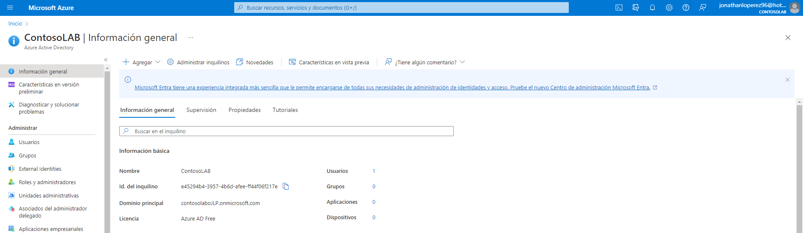

• Tarea 4: Administrar invitados en Azure AD.

1- En el portal Azure que muestra el tenant Azure AD de Contoso Lab, en la sección Gestionar, haga clic en Usuarios y, a continuación, en + Nuevo usuario.

2- Cree un nuevo usuario con la siguiente configuración (deje los demás valores predeterminados):

| Setting                    | Value                     |
|----------------------------|---------------------------|
| User name                  | az104-01b-aaduser1        |
| Name                       | az104-01b-aaduser1        |
| Let me create the password | enabled                   |
| Initial password           | Provide a secure password |
| Job title                  | System Administrator      |
| Department                 | IT                        |

3- Haga clic en el perfil recién creado y copia el nombre.

4- Vuelva a su inquilino Azure AD predeterminado utilizando el botón Directorio + Suscripción (directamente a la derecha del botón Cloud Shell) en la barra de herramientas del portal Azure.

5- Navegue de nuevo a la hoja Usuarios - Todos los usuarios y, a continuación, haga clic en + Invitar usuario externo.

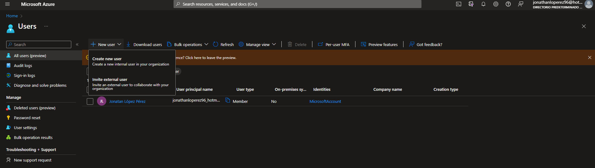

6- Invite a un nuevo usuario invitado con la siguiente configuración (deje los demás con sus valores predeterminados):

| Setting        | Value                                                   |
|----------------|---------------------------------------------------------|
| Name           | az104-01b-aaduser1                                      |
| Email address  | the User Principal Name you copied earlier in this task |
| Usage location | United States                                           |
| Job title      | Lab Administrator                                       |
| Department     | IT                                                      |

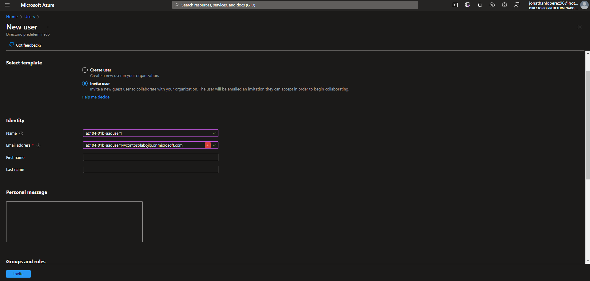

7- Haga clic en Invitar.

8- De nuevo en el módulo Usuarios - Todos los usuarios, haga clic en la entrada que representa la cuenta de usuario invitado recién creada.

9- En az104-01b-aaduser1 - Perfil, haga clic en Grupos.

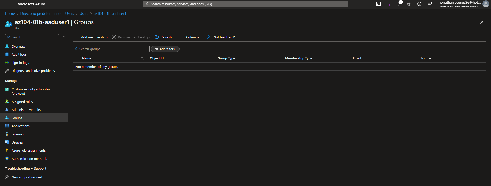

10- Haga clic en + Añadir pertenencia y añada la cuenta de usuario invitado al grupo Administradores del laboratorio de IT.

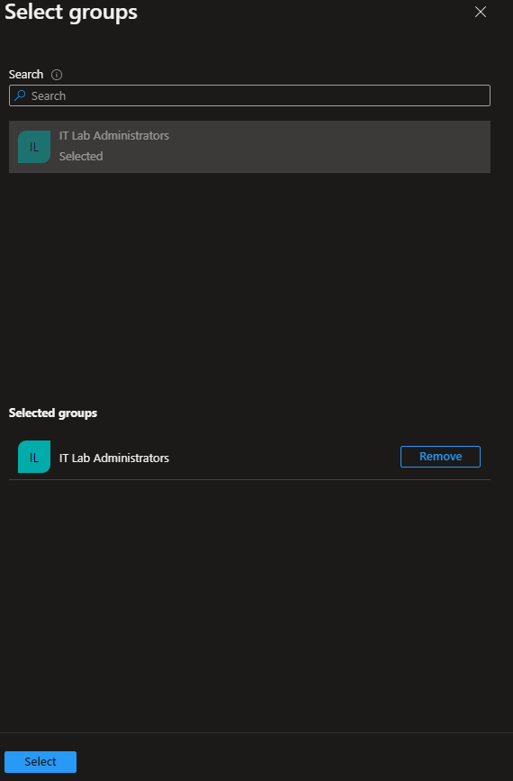