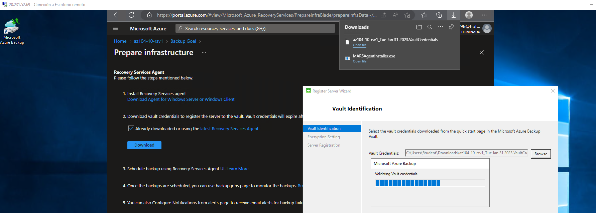

# Copia de seguridad de máquinas virtuales

Se le ha encomendado la tarea de evaluar el uso de Azure Recovery Services para realizar copias de seguridad y restauraciones de archivos alojados en máquinas virtuales Azure y equipos locales. Además, desea identificar métodos para proteger los datos almacenados en el almacén de Recovery Services frente a pérdidas de datos accidentales o malintencionadas.

## Tarea 1: Aprovisionar el entorno de laboratorio

1- Inicie sesión en el portal Azure.

2- En el portal Azure, abra Azure Cloud Shell haciendo clic en el icono de la parte superior derecha del portal Azure.

3- Si se le pide que seleccione Bash o PowerShell, seleccione PowerShell.

4- En la barra de herramientas del panel de Cloud Shell, haga clic en el icono Cargar/Descargar archivos; en el menú desplegable, haga clic en Cargar y cargue los archivos \Allfiles\Labs\10\az104-10-vms-edge-template.json y \Allfiles\Labs\10\az104-10-vms-edge-parameters.json en el directorio principal de Cloud Shell.

5- Edite el archivo Parámetros que acaba de cargar y cambie la contraseña. Si necesita ayuda para editar el archivo en Shell, pida ayuda a su instructor. Como práctica recomendada, los secretos, como las contraseñas, deberían almacenarse de forma más segura en la Bóveda de claves.

6- En el panel Shell de la nube, ejecute lo siguiente para crear el grupo de recursos que alojará las máquinas virtuales (sustituya el marcador de posición [Azure_region] por el nombre de una región Azure en la que pretenda desplegar máquinas virtuales Azure). Escriba cada línea de comando por separado y ejecútelas por separado:

`$location = '[Azure_region]'`

`$rgName = 'az104-10-rg0'`

`New-AzResourceGroup -Name $rgName -Location $location`

7- Desde el panel Cloud Shell, ejecute lo siguiente para crear la primera red virtual y desplegar una máquina virtual en ella utilizando la plantilla y los archivos de parámetros que cargó:

`New-AzResourceGroupDeployment -ResourceGroupName $rgName -TemplateFile az104-10-vms-edge-template.json -TemplateParameterFile az104-10-vms-edge-parameters.json -AsJob`

8- Minimice Cloud Shell (pero no lo cierre).

## Tarea 2: Crear una bóveda de Recovery Services

1- En el portal Azure, busque y seleccione Recovery Services vaults y, en el blade Recovery Services vaults, haga clic en + Create.

2- En el blade Crear almacén de servicios de recuperación, especifique la siguiente configuración:

| Settings       | Value                                                                                 |
|----------------|---------------------------------------------------------------------------------------|
| Subscription   | the name of the Azure subscription you are using in this lab                          |
| Resource group | the name of a new resource group az104-10-rg1                                         |
| Vault Name     | az104-10-rsv1                                                                         |
| Region         | the name of a region where you deployed the two virtual machines in the previous task |

3- Haga clic en Revisar + Crear, asegúrese de que la validación se ha superado y haga clic en Crear.

4- Una vez completado el despliegue, haga clic en Ir al recurso.

5- En el blade az104-10-rsv1 Recovery Services, en la sección Settings, haga clic en Properties.

6- En el blade az104-10-rsv1 - Propiedades, haga clic en el enlace Actualizar bajo la etiqueta Configuración de copia de seguridad.

7- En la hoja Configuración de copia de seguridad, observe que puede establecer el tipo de replicación de almacenamiento como Localmente redundante o Georredundante. Deje la configuración predeterminada de Geo-redundante y cierre el blade.

8- De nuevo en el blade az104-10-rsv1 - Propiedades, haga clic en el enlace Actualizar bajo la etiqueta Configuración de seguridad.

9- En la hoja Configuración de seguridad, observe que la opción Eliminación suave (para cargas de trabajo que se ejecutan en Azure) está Activada.

10- Cierre el blade Configuración de seguridad y, de nuevo en el blade az104-10-rsv1 Recovery Services vault, haga clic en Descripción general.

## Tarea 3: Implementar la copia de seguridad a nivel de máquina virtual Azure

1- En el blade az104-10-rsv1 Recovery Services, haga clic en Overview y, a continuación, en + Backup.

2- En el blade Objetivo de copia de seguridad, especifique la siguiente configuración:

| Settings                        | Value           |
|---------------------------------|-----------------|
| Where is your workload running? | Azure           |
| What do you want to backup?     | Virtual machine |

3- En el blade Objetivo de copia de seguridad, haga clic en Copia de seguridad.

4- En la política de copia de seguridad, revise la configuración de DefaultPolicy y seleccione Crear una nueva política.

5- Defina una nueva política de copia de seguridad con los siguientes parámetros (deje los demás con sus valores predeterminados):

| Setting                                 | Value                            |
|-----------------------------------------|----------------------------------|
| Policy name                             | az104-10-backup-policy           |
| Frequency                               | Daily                            |
| Time                                    | 12:00 AM                         |
| Timezone                                | the name of your local time zone |
| Retain instant recovery snapshot(s) for | 2 Days(s)                        |

6- Haga clic en Aceptar para crear la política y, a continuación, en la sección Máquinas virtuales, seleccione Añadir.

7- En el blade Seleccionar máquinas virtuales, seleccione az-104-10-vm0, haga clic en Aceptar y, de nuevo en el blade Copia de seguridad, haga clic en Activar copia de seguridad.

8- Vuelva al blade az104-10-rsv1 Recovery Services vault, en la sección Protected items, haga clic en Backup items y, a continuación, en la entrada Azure virtual machine.

9- En el blade Elementos de copia de seguridad (máquina virtual Azure), seleccione el enlace Ver detalles para az104-10-vm0 y revise los valores de las entradas Comprobación previa de copia de seguridad y Estado de la última copia de seguridad.

10- En el blade az104-10-vm0 Backup Item, haga clic en Backup now, acepte el valor predeterminado en la lista desplegable Retain Backup Till y haga clic en OK.

## Tarea 4: Implementar la copia de seguridad de archivos y carpetas

1- En el portal Azure, busque y seleccione Máquinas virtuales y, en el blade Máquinas virtuales, haga clic en az104-10-vm1.

2- En el blade az104-10-vm1, haga clic en Conectar, en el menú desplegable, haga clic en RDP, en el blade Conectar con RDP, haga clic en Descargar archivo RDP y siga las instrucciones para iniciar la sesión de Escritorio remoto.

3- Cuando se le solicite, inicie sesión utilizando el nombre de usuario de Estudiante y la contraseña del archivo de parámetros.

4- Dentro de la sesión de Escritorio Remoto a la máquina virtual Azure az104-10-vm1, inicie un navegador web Edge, navegue hasta el portal Azure e inicie sesión utilizando sus credenciales.

5- En el portal Azure, busque y seleccione Recovery Services vaults y, en Recovery Services vaults, haga clic en az104-10-rsv1.

6- En la hoja de la bóveda de Servicios de recuperación az104-10-rsv1, haga clic en + Copia de seguridad.

7- En el blade Objetivo de copia de seguridad, especifique la siguiente configuración:

| Settings                        | Value             |
|---------------------------------|-------------------|
| Where is your workload running? | On-premises       |
| What do you want to backup?     | Files and folders |

8- En el blade Objetivo de copia de seguridad, haga clic en Preparar infraestructura.

9- En el blade Preparar infraestructura, haga clic en el enlace Descargar agente para Windows Server o Windows Client.

10- Cuando se le solicite, haga clic en Ejecutar para iniciar la instalación de MARSAgentInstaller.exe con la configuración predeterminada.

11- En la página Instalación del Asistente de configuración del Agente de Microsoft Azure Recovery Services, haga clic en Continuar con el registro. Esto iniciará el Asistente de registro del servidor.

12- Cambie a la ventana del navegador web que muestra el portal Azure, en la hoja Prepare infrastructure, seleccione la casilla Already downloaded or using the latest Recovery Server Agent y haga clic en Download.

13- Cuando se le pregunte si desea abrir o guardar el archivo de credenciales del almacén, haga clic en Guardar. Esto guardará el archivo de credenciales del almacén en la carpeta local Descargas.

14- Vuelva a la ventana del Asistente para registrar servidores y, en la página Identificación del almacén, haga clic en Examinar.

15- En el cuadro de diálogo Seleccionar credenciales de almacén, vaya a la carpeta Descargas, haga clic en el archivo de credenciales de almacén que descargó y haga clic en Abrir.

16- De nuevo en la página Identificación del almacén, haga clic en Siguiente.

17- En la página Configuración de cifrado del Asistente de registro del servidor, haga clic en Generar frase de contraseña.

18- En la página Configuración de cifrado del Asistente para servidor de registro, haga clic en el botón Examinar situado junto a Introduzca una ubicación para guardar la frase de contraseña.

19- En el cuadro de diálogo Buscar carpeta, seleccione la carpeta Documentos y haga clic en Aceptar.

20- Haga clic en Finalizar, revise la advertencia de Microsoft Azure Backup y haga clic en Sí, y espere a que se complete el registro.

21- En la página Server Registration (Registro del servidor) del asistente Register Server Wizard (Registrar servidor), revise la advertencia relativa a la ubicación del archivo de frase de contraseña, asegúrese de que la casilla Launch Microsoft Azure Recovery Services Agent (Iniciar Microsoft Azure Recovery Services Agent) esté seleccionada y haga clic en Close (Cerrar). Esto abrirá automáticamente la consola Microsoft Azure Backup.

22- En la consola Microsoft Azure Backup, en el panel Acciones, haga clic en Programar copia de seguridad.

23- En el Asistente para programar copias de seguridad, en la página Introducción, haga clic en Siguiente.

24- En la página Seleccionar elementos para copia de seguridad, haga clic en Agregar elementos.

25- En el cuadro de diálogo Seleccionar elementos, expanda C:\Windows\System32\drivers\etc\, seleccione hosts y haga clic en Aceptar:

26- En la página Seleccionar elementos para copia de seguridad, haga clic en Siguiente.

27- En la página Especificar programación de copias de seguridad, asegúrese de que la opción Día está seleccionada, en el primer cuadro de lista desplegable situado debajo del cuadro A las siguientes horas (el máximo permitido es tres veces al día), seleccione 4:30 AM y, a continuación, haga clic en Siguiente.

28- En la página Seleccionar política de retención, acepte los valores predeterminados y, a continuación, haga clic en Siguiente.

29- En la página Elegir tipo de copia de seguridad inicial, acepte los valores predeterminados y haga clic en Siguiente.

30- En la página Confirmación, haga clic en Finalizar. Cuando se haya creado el programa de copia de seguridad, haga clic en Cerrar.

31- En la consola de Microsoft Azure Backup, en el panel Acciones, haga clic en Realizar copia de seguridad ahora.

32- En el Asistente para copia de seguridad ahora, en la página Seleccionar elemento de copia de seguridad, asegúrese de que la opción Archivos y carpetas esté seleccionada y haga clic en Siguiente.

33- En la página Conservar copia de seguridad, acepte la configuración predeterminada y haga clic en Siguiente.

34- En la página Confirmación, haga clic en Copia de seguridad.

35- Cuando finalice la copia de seguridad, haga clic en Cerrar y, a continuación, cierre Microsoft Azure Backup.

36- Cambie a la ventana del navegador web que muestra el portal de Azure, navegue de nuevo a la hoja del almacén de Servicios de recuperación, en la sección Elementos protegidos, y haga clic en Elementos de copia de seguridad.

37- En el blade az104-10-rsv1 - Elementos de copia de seguridad, haga clic en Azure Backup Agent.

38- En el blade Elementos de copia de seguridad (Azure Backup Agent), compruebe que hay una entrada que hace referencia a la unidad C:³ de az104-10-vm1..

## Tarea 5: Realizar la recuperación de archivos utilizando el agente de Azure Recovery Services

1- Dentro de la sesión de Escritorio Remoto a az104-10-vm1, abra el Explorador de Archivos, navegue a la carpeta C:\Windows\System32\drivers\etc\ y elimine el archivo hosts.

2- Abra Microsoft Azure Backup y haga clic en Recuperar datos en el panel Acciones. Se iniciará el Asistente para la recuperación de datos.

3- En la página Getting Started (Introducción) del Asistente para la recuperación de datos, asegúrese de que la opción This server (az104-10-vm1.) (Este servidor (az104-10-vm1.)) esté seleccionada y haga clic en Next (Siguiente).

4- En la página Seleccionar modo de recuperación, asegúrese de que está seleccionada la opción Archivos y carpetas individuales y haga clic en Siguiente.

5- En la página Seleccionar volumen y fecha, en la lista desplegable Seleccionar el volumen, seleccione C:\, acepte la selección predeterminada de la copia de seguridad disponible y haga clic en Montar.

6- En la página Examinar y recuperar archivos, anote la letra de la unidad del volumen de recuperación y revise el consejo sobre el uso de robocopy.

7- Haga clic en Inicio, expanda la carpeta Sistema Windows y haga clic en Símbolo del sistema.

8- Desde el Símbolo del sistema, ejecute lo siguiente para copiar el archivo de restauración de hosts en la ubicación original (sustituya [volumen_de_recuperación] por la letra de la unidad del volumen de recuperación que identificó anteriormente):

`robocopy [recovery_volume]:\Windows\System32\drivers\etc C:\Windows\system32\drivers\etc hosts /r:1 /w:1`

9- Vuelva al Asistente para la recuperación de datos y, en Examinar y recuperar archivos, haga clic en Desmontar y, cuando se le pida confirmación, haga clic en Sí.

10- Finalice la sesión de Escritorio Remoto.

## Tarea 6: Realizar la recuperación de archivos mediante el uso de instantáneas de máquinas virtuales Azure (opcional)

1- Cambie a la ventana del navegador que se ejecuta en su ordenador de laboratorio y que muestra el portal Azure.

2- En el portal Azure, busque y seleccione Máquinas virtuales y, en el blade Máquinas virtuales, haga clic en az104-10-vm0.

3- En el blade az104-10-vm0, haga clic en Conectar, en el menú desplegable, haga clic en RDP, en el blade Conectar con RDP, haga clic en Descargar archivo RDP y siga las instrucciones para iniciar la sesión de Escritorio remoto.

4- Cuando se le solicite, inicie sesión utilizando el nombre de usuario de Estudiante y la contraseña del archivo de parámetros.

5- Dentro de la sesión de Escritorio Remoto al az104-10-vm0, haga clic en Inicio, expanda la carpeta Sistema Windows y haga clic en Símbolo del sistema.

6- Desde el Símbolo del sistema, ejecute lo siguiente para eliminar el archivo hosts:

7- En la sesión de Escritorio remoto de la máquina virtual Azure az104-10-vm0, inicie un navegador web Edge, vaya al portal Azure e inicie sesión con sus credenciales.

8- En el portal Azure, busque y seleccione Recovery Services vaults y, en Recovery Services vaults, haga clic en az104-10-rsv1.

9- En la hoja del almacén de Servicios de recuperación az104-10-rsv1, en la sección Elementos protegidos, haga clic en Elementos de copia de seguridad.

10- En el blade az104-10-rsv1 - Elementos de copia de seguridad, haga clic en Azure Virtual Machine.

11- En el blade Elementos de copia de seguridad (Azure Virtual Machine), seleccione Ver detalles para az104-10-vm0.

12- En el blade az104-10-vm0 Elemento de copia de seguridad, haga clic en Recuperación de archivos.

13- En el blade Recuperación de archivos, acepte el punto de recuperación predeterminado y haga clic en Descargar ejecutable.

14- Haga clic en Descargar y, cuando se le pregunte si desea ejecutar o guardar IaaSVMILRExeForWindows.exe, haga clic en Guardar.

15- De vuelta en la ventana del Explorador de archivos, haga doble clic en el archivo recién descargado.

16- Cuando se le pida que proporcione la contraseña del portal, copie la contraseña del cuadro de texto Contraseña para ejecutar el script en la hoja de recuperación de archivos, péguela en el símbolo del sistema y pulse Intro.

17- Espere a que finalice el proceso de montaje, revise los mensajes informativos en la ventana de Windows PowerShell, anote la letra de unidad asignada al volumen que aloja Windows e inicie el Explorador de archivos.

18- En el Explorador de archivos, vaya a la letra de unidad que aloja la instantánea del volumen del sistema operativo que identificó en el paso anterior y revise su contenido.

19- Cambie a la ventana Símbolo del sistema.

20- Desde el Símbolo del sistema, ejecute lo siguiente para copiar el archivo de restauración de hosts a la ubicación original (sustituya [os_volume] por la letra de la unidad del volumen del sistema operativo que identificó anteriormente):

`robocopy [os_volume]:\Windows\System32\drivers\etc C:\Windows\system32\drivers\etc hosts /r:1 /w:1`

21- Vuelva a la hoja Recuperación de archivos en el portal Azure y haga clic en Desmontar discos.

22- Finalice la sesión de Escritorio remoto.

## Tarea 7: Revisar la funcionalidad de borrado suave de Azure Recovery Services (opcional)

1- En el ordenador del laboratorio, en el portal Azure, busque y seleccione Recovery Services vaults y, en Recovery Services vaults, haga clic en az104-10-rsv1.

2- En az104-10-rsv1 Recovery Services vault blade, en la sección Protected items, haga clic en Backup items.

3- En el blade az104-10-rsv1 - Elementos de copia de seguridad, haga clic en Azure Backup Agent.

4- En el blade Elementos de copia de seguridad (Azure Backup Agent), haga clic en la entrada que representa la copia de seguridad de az104-10-vm1.

5- En el blade C:\ on az104-10-vm1., seleccione View details for az104-10-vm1. .

6- En el blade Detalle, haga clic en az104-10-vm1.

7- En el blade az104-10-vm1. Servidores protegidos, haga clic en Eliminar.

8- En el blade Eliminar, especifique la siguiente configuración.

| Settings             | Value                     |
|----------------------|---------------------------|
| TYPE THE SERVER NAME | az104-10-vm1.             |
| Reason               | Recycling Dev/Test server |
| Comments             | az104 10 lab              |

9- Active la casilla de verificación situada junto a la etiqueta Hay datos de copia de seguridad de 1 elementos de copia de seguridad asociados a este servidor. Entiendo que al hacer clic en "Confirmar" se eliminarán permanentemente todos los datos de copia de seguridad en la nube. Esta acción no se puede deshacer. Se puede enviar una alerta a los administradores de esta suscripción notificándoles esta eliminación y hacer clic en Eliminar.

10- Vuelva a la hoja az104-10-rsv1 - Elementos de copia de seguridad y haga clic en Azure Virtual Machines.

11- En az104-10-rsv1 - Backup items blade, haga clic en Azure Virtual Machine.

12- En el blade Elementos de copia de seguridad (Azure Virtual Machine), seleccione Ver detalles para az104-10-vm0.

13- En el blade Elementos de copia de seguridad az104-10-vm0, haga clic en Detener copia de seguridad.

14- En el blade Detener copia de seguridad, seleccione Eliminar datos de copia de seguridad, especifique la siguiente configuración y haga clic en Detener copia de seguridad:

| Settings                     | Value        |
|------------------------------|--------------|
| Type the name of Backup item | az104-10-vm0 |
| Reason                       | Others       |
| Comments                     | az104 10 lab |

15- Vuelva a la hoja az104-10-rsv1 - Elementos de copia de seguridad y haga clic en Actualizar.

16- Haga clic en la entrada Azure Virtual Machine y, en el blade Backup Items (Azure Virtual Machine), haga clic en la entrada az104-10-vm0.

17- En la hoja Elementos de copia de seguridad az104-10-vm0, observe que tiene la opción de Deshacer la copia de seguridad eliminada.

18- Vuelva al blade az104-10-rsv1 Recovery Services vault y, en la sección Settings, haga clic en Properties.

19- En la hoja az104-10-rsv1 - Propiedades, haga clic en el enlace Actualizar bajo la etiqueta Configuración de seguridad.

20- En la hoja Configuración de seguridad, desactive la eliminación suave (para cargas de trabajo que se ejecutan en Azure) y desactive también las funciones de seguridad (para cargas de trabajo que se ejecutan en las instalaciones) y haga clic en Guardar.

21- Cierre la hoja Configuración de seguridad y, de nuevo en la hoja del almacén de servicios de recuperación az104-10-rsv1, haga clic en Descripción general.

22- Vuelva al blade az104-10-vm0 Backup Item y haga clic en Undelete.

23- En el blade Undelete az104-10-vm0, haga clic en Undelete.

24- Espere a que se complete la operación de anulación de la eliminación, actualice la página del navegador Web, si es necesario, vuelva a navegar hasta el blade az104-10-vm0 Backup Item y haga clic en Delete backup data.

25- En el blade Eliminar datos de copia de seguridad, especifique la siguiente configuración y haga clic en Eliminar:

| Settings                     | Value        |
|------------------------------|--------------|
| Type the name of Backup item | az104-10-vm0 |
| Reason                       | Others       |
| Comments                     | az104 10 lab |

26- Repita los pasos del principio de esta tarea para eliminar los elementos de copia de seguridad de az104-10-vm1.

