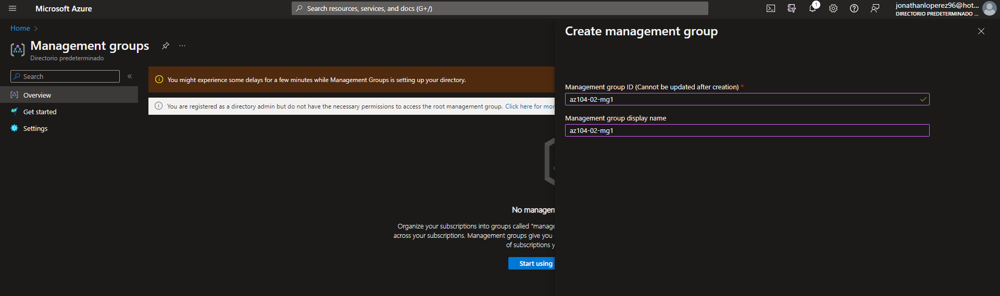
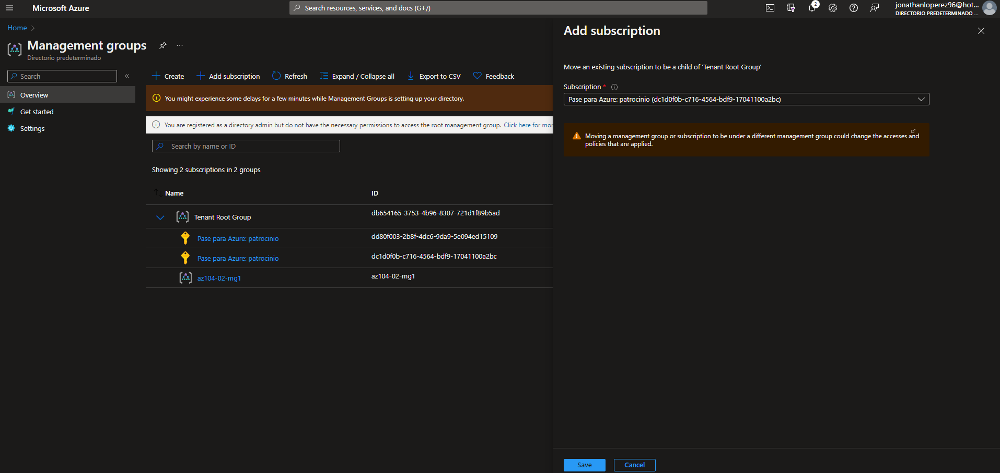
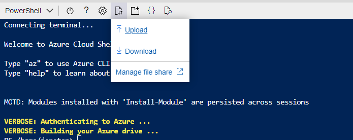
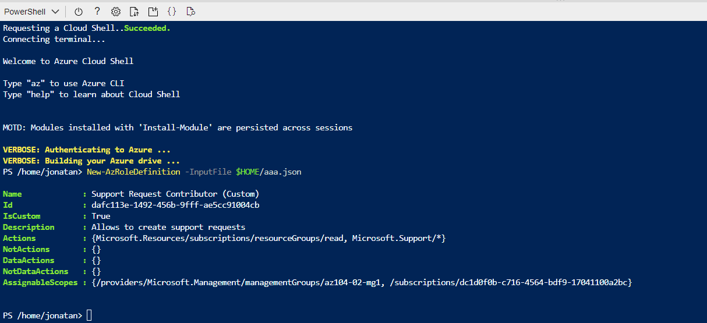
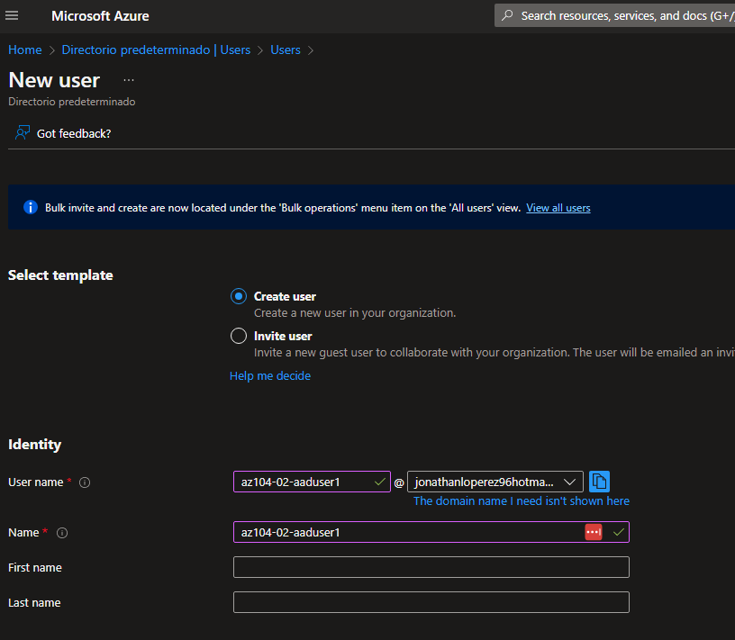
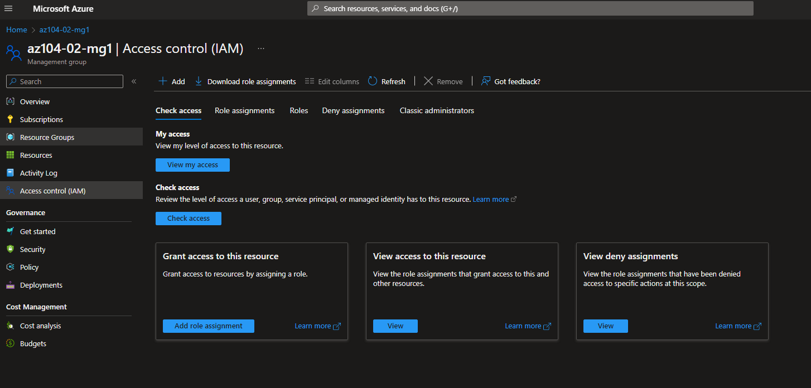
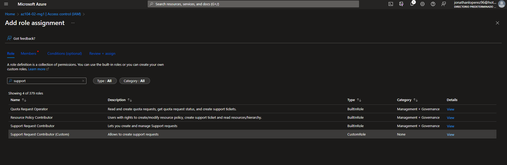
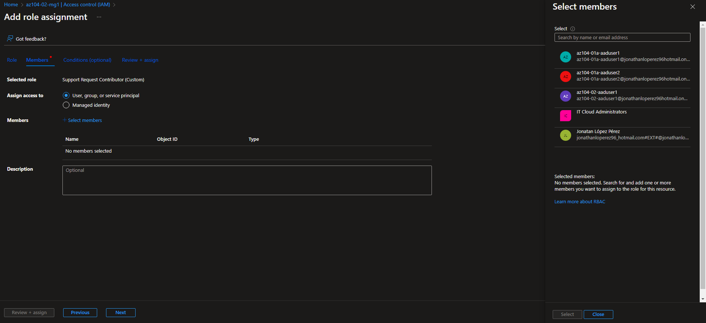
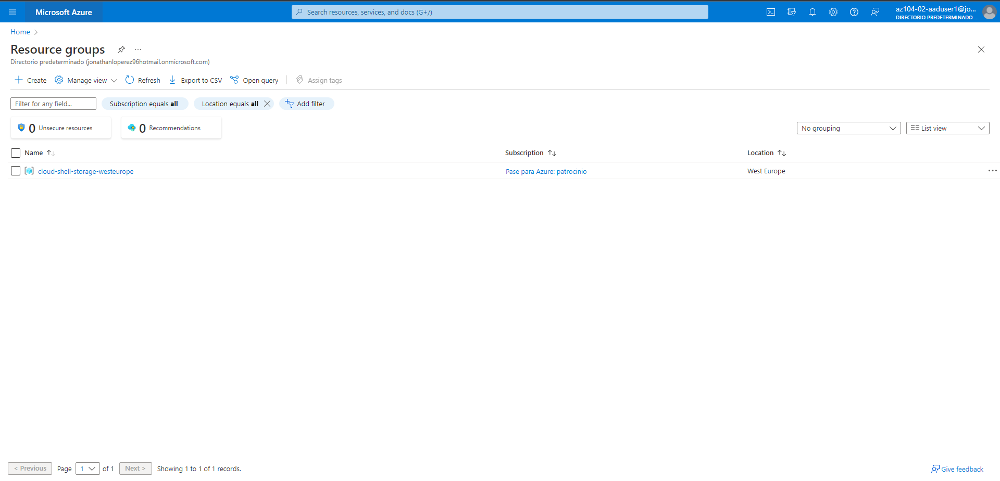
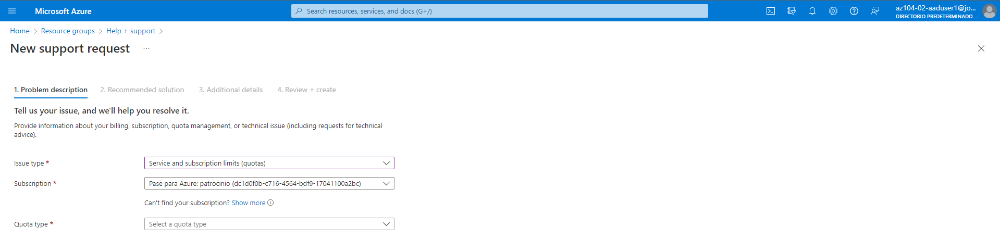

# LAB 2 - Administrar suscripciones y RBAC.

Para mejorar la administración de recursos en Contoso, se te ha pedido:

• Crear un grupo de gestión que incluya todas las suscripciones de azure.

• Darle permisos para enviar tickets de soporte para un usuario.

Proyecto: [a](./img/199.png)

Task 1: Implement Management Groups

1- Crea un grupo de gestión de recursos con estos parámetros:

> Si no funciona, dale permisos a tu usuario.

| Setting                       | Value        |
|-------------------------------|--------------|
| Management group ID           | az104-02-mg1 |
| Management group display name | az104-02-mg1 |

2- Añade la suscripción correspondiente.

Task 2: Create custom RBAC roles

1- Crea un nuevo fichero de texto con este contenido:

`{
   "Name": "Support Request Contributor (Custom)",
   "IsCustom": true,
   "Description": "Allows to create support requests",
   "Actions": [
       "Microsoft.Resources/subscriptions/resourceGroups/read",
       "Microsoft.Support/*"
   ],
   "NotActions": [
   ],
   "AssignableScopes": [
       "/providers/Microsoft.Management/managementGroups/az104-02-mg1",
       "/subscriptions/SUBSCRIPTION_ID"
   ]
}`

Sustituye `SUSCRIPTION ID` con tu la ID de tu suscripción.

2- Ahora subiremos este JSON a través de la consola del portal de azure.

3- Creamos una nueva definición de rol:

`New-AzRoleDefinition -InputFile $HOME/aaa.json`

Task 3: Assign RBAC roles

Vamos a crear un usuario con el rol creado anteriormente.

1- Crea un nuevo usuario con los siguientes parámetros:

| Setting                    | Value                     |
|----------------------------|---------------------------|
| User name                  | az104-02-aaduser1         |
| Name                       | az104-02-aaduser1         |
| Let me create the password | enabled                   |
| Initial password           | Provide a secure password |

2- Vuelve al grupo de gestión creado y añade el rol de Support Request Contributor (custom)

Añadimos el usuario creado.

3- Nos conectamos con el nuevo usuario.

Comprobamos que el usuario puede ver todos los grupos de recursos.

Creamos un ticket de ayuda, con el problema de Service and subscription limits (quotas).

4- Cerramos sesión.
