# Gestión de gobernanza via directivas de Azure

Con el fin de mejorar la gestión de los recursos de Azure en Contoso, se le ha encargado la implementación de la siguiente funcionalidad:

• Etiquetar grupos de recursos que incluyan sólo recursos de infraestructura (como cuentas de almacenamiento Cloud Shell)

• Garantizar que sólo los recursos de infraestructura etiquetados correctamente puedan añadirse a los grupos de recursos de infraestructura.

• Remediar cualquier recurso no conforme.

## Tarea 1: Crear y asignar etiquetas a través del portal de Azure

1- En el portal de Azure, inicie una sesión PowerShell dentro de Cloud Shell.

2- En el panel Cloud Shell, ejecute lo siguiente para identificar el nombre de la cuenta de almacenamiento utilizada por Cloud Shell:

`df`

3- En la salida del comando, observe la primera parte de la ruta completa que designa el montaje de la unidad de inicio de Cloud Shell (marcada aquí como `xxxxxxxxxxxxxx`:

`//xxxxxxxxxxxxxx.file.core.windows.net/cloudshell   (..)  /usr/csuser/clouddrive`

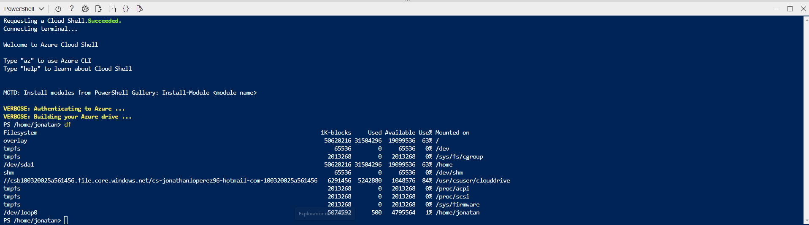

4- En el portal Azure, busque y seleccione Cuentas de almacenamiento y, en la lista de las cuentas de almacenamiento, haga clic en la entrada que representa la cuenta de almacenamiento que identificó en el paso anterior.

5- En la hoja de la cuenta de almacenamiento, haz clic en el enlace que representa el nombre del grupo de recursos que contiene la cuenta de almacenamiento.

6- En la hoja del grupo de recursos, haga clic en Editar junto a Etiquetas para crear nuevas etiquetas.

7- Cree una etiqueta con la siguiente configuración y aplique los cambios:

| Setting | Value |
|---------|-------|
| Name    | Role  |
| Value   | Infra |

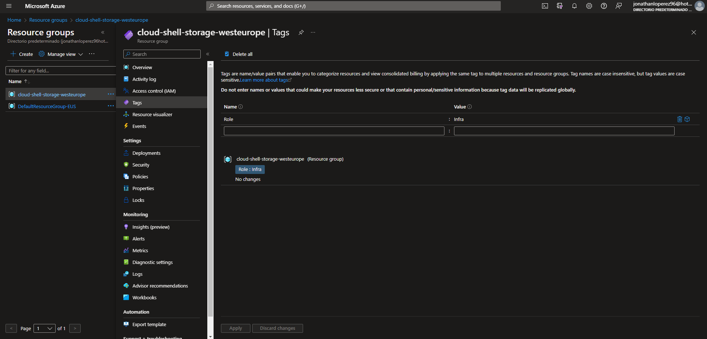

8- Vuelva a la hoja de la cuenta de almacenamiento. Revise la información general y observe que la nueva etiqueta no se ha asignado automáticamente a la cuenta de almacenamiento.

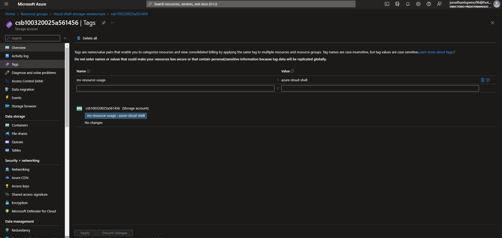

## Tarea 2: Aplicar el etiquetado mediante una política de Azure

1- En el portal Azure, busque y seleccione Política.

2- En la sección Creación, haga clic en Definiciones. Tómese un momento para examinar la lista de definiciones de políticas integradas que puede utilizar. Enumere todas las políticas integradas que implican el uso de etiquetas seleccionando la entrada Etiquetas (y deseleccionando todas las demás entradas) en la lista desplegable Categoría.

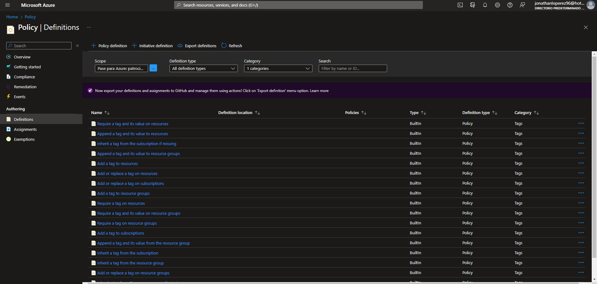

3- Haga clic en la entrada que representa "Requerir una etiqueta y su valor en la política integrada de recursos" y revise su definición.

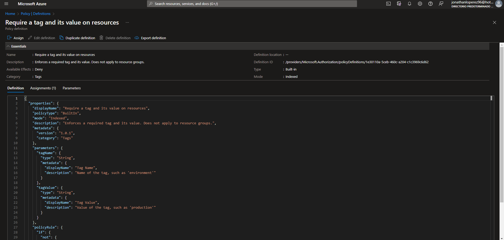

4- En la hoja de definición "Requerir una etiqueta y su valor en la política integrada de recursos", haga clic en Asignar.

5- Especifique el Ámbito haciendo clic en el botón de elipsis y seleccionando los siguientes valores:

| Setting        | Value                                                                                                 |
|----------------|-------------------------------------------------------------------------------------------------------|
| Subscription   | the name of the Azure subscription you are using in this lab                                          |
| Resource Group | the name of the resource group containing the Cloud Shell account you identified in the previous task |

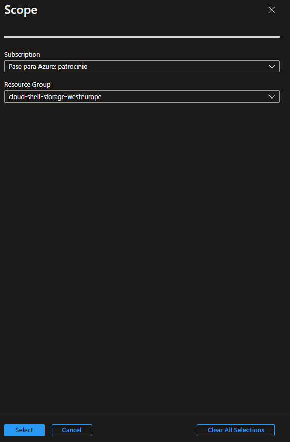

6- Configure las propiedades Básicas de la asignación especificando los siguientes valores (deje los demás con sus valores predeterminados):

| Setting            | Value                                                                                 |
|--------------------|---------------------------------------------------------------------------------------|
| Assignment name    | Require Role tag with Infra value                                                     |
| Description        | Require Role tag with Infra value for all resources in the Cloud Shell resource group |
| Policy enforcement | Enabled                                                                               |

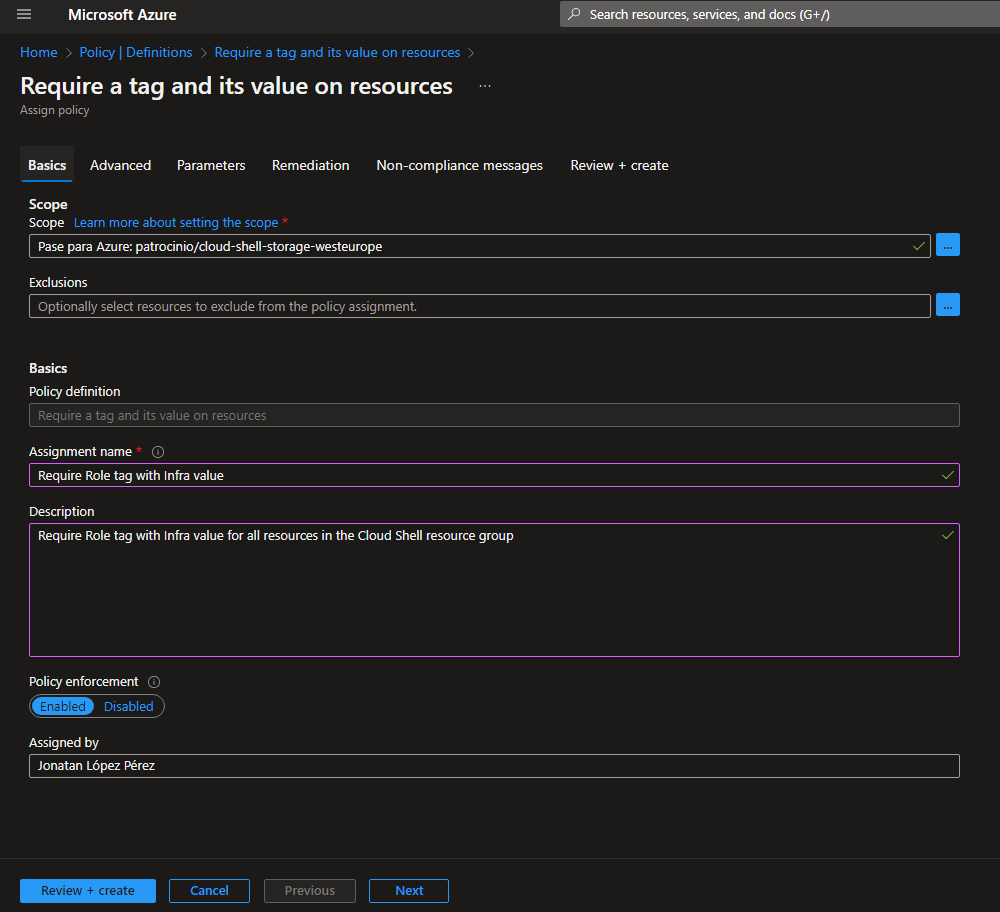

7- Haga clic en Siguiente y configure Parámetros con los siguientes valores:

| Setting   | Value |
|-----------|-------|
| Tag Name  | Role  |
| Tag Value | Infra |

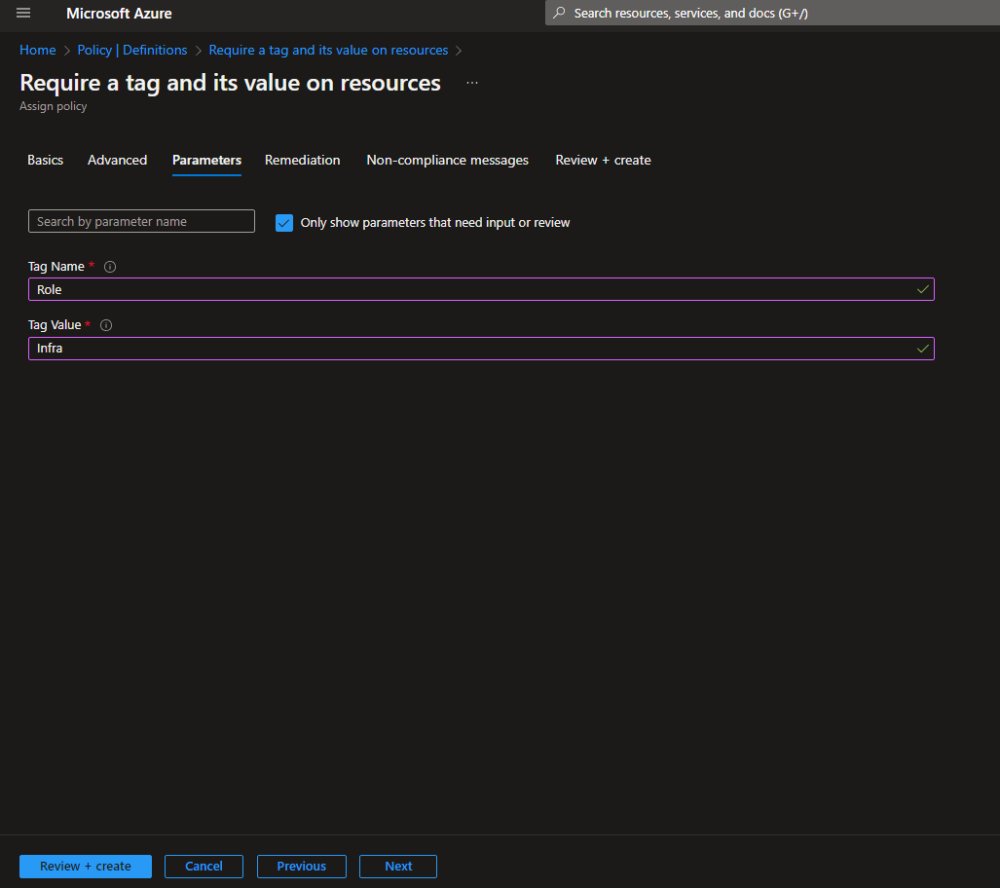

8- Haga clic en Siguiente y revise la pestaña Remediación. Deje sin marcar la casilla de verificación Crear una identidad gestionada.

9- Haga clic en Revisar + Crear y, a continuación, en Crear.

10- Navegue de nuevo a la hoja del grupo de recursos que aloja la cuenta de almacenamiento utilizada para la unidad principal de Cloud Shell, que identificó en la tarea anterior.

11- En la hoja del grupo de recursos, haga clic en + Crear, busque Cuenta de almacenamiento y haga clic en + Crear.

12- En la pestaña Conceptos básicos de la hoja Crear cuenta de almacenamiento, compruebe que está utilizando el grupo de recursos al que se aplicó la política y especifique los siguientes parámetros (deje los demás con sus valores predeterminados), haga clic en Revisar + crear y, a continuación, haga clic en Crear:

| Setting              | Value                                                                                                     |
|----------------------|-----------------------------------------------------------------------------------------------------------|
| Storage account name | any globally unique combination of between 3 and 24 lower case letters and digits, starting with a letter |

13- Una vez creado el despliegue, debería ver el mensaje Despliegue fallido en la lista de Notificaciones del portal. En la lista de notificaciones, vaya a la descripción general de la implantación y haga clic en el mensaje Error de implantación. Haga clic aquí para ver el mensaje de detalles e identificar el motivo del fallo.

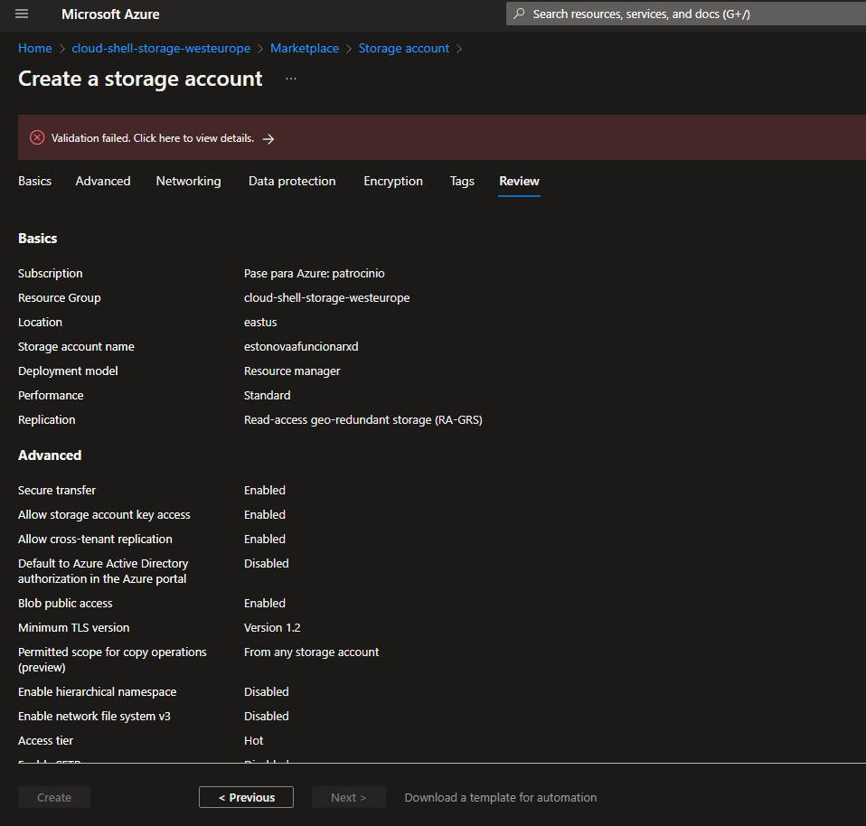

## Tarea 3: Aplicar el etiquetado mediante una política de Azure

1- En el portal Azure, busque y seleccione Política.

2- En la sección Creación, haga clic en Asignaciones.

3- En la lista de asignaciones, haga clic en el icono de elipsis en la fila que representa la asignación de política Require Role tag with Infra value y utilice el elemento de menú Delete assignment para eliminar la asignación.

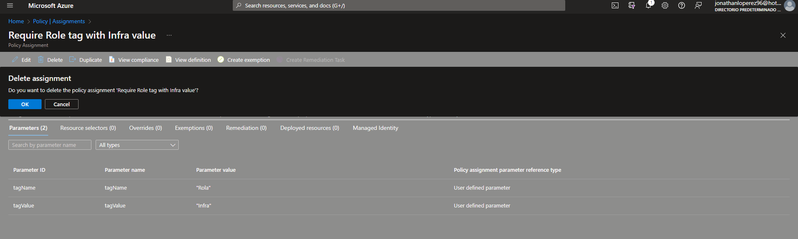

4- Haga clic en Asignar política y especifique el Ámbito haciendo clic en el botón de elipsis y seleccionando los siguientes valores:

| Setting        | Value                                                                                              |
|----------------|----------------------------------------------------------------------------------------------------|
| Subscription   | the name of the Azure subscription you are using in this lab                                       |
| Resource Group | the name of the resource group containing the Cloud Shell account you identified in the first task |

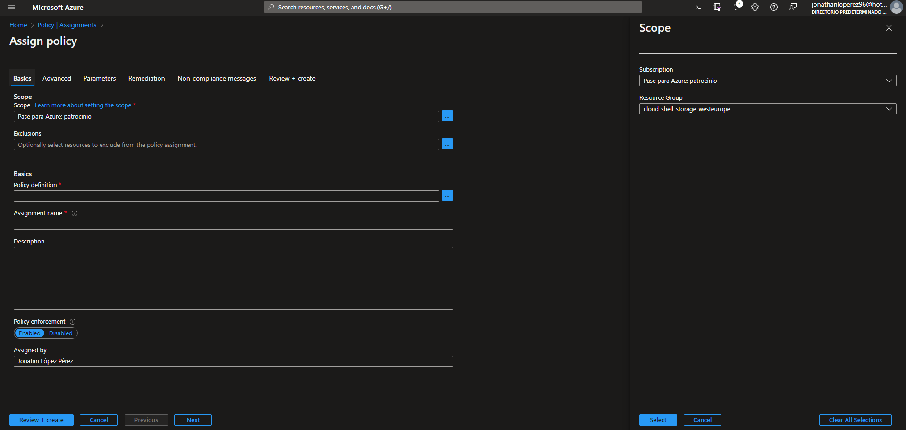

5- Para especificar la Definición de política, haga clic en el botón de elipsis y, a continuación, busque y seleccione "Heredar una etiqueta del grupo de recursos si falta".

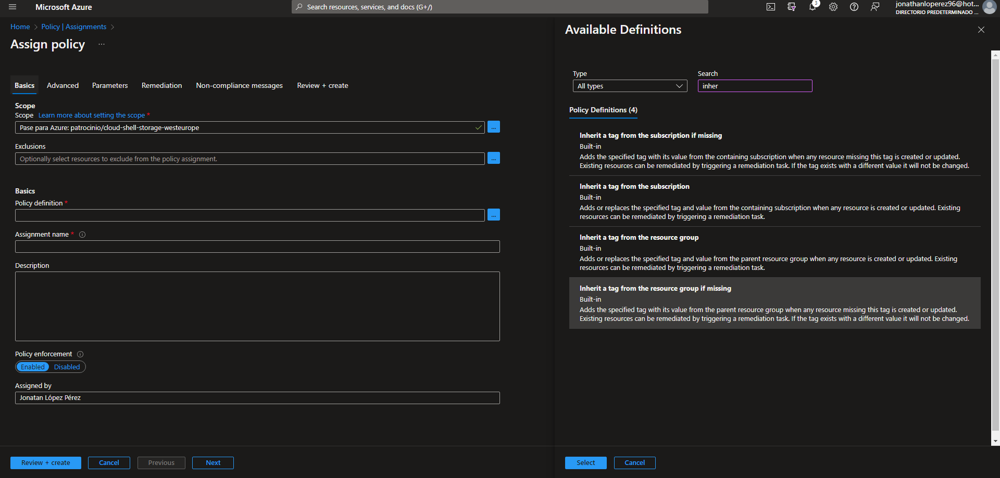

6- Configure las restantes propiedades Básicas de la asignación especificando los siguientes valores (deje los demás con sus valores predeterminados):

| Setting            | Value                                                                                   |
|--------------------|-----------------------------------------------------------------------------------------|
| Assignment name    | Inherit the Role tag and its Infra value from the Cloud Shell resource group if missing |
| Description        | Inherit the Role tag and its Infra value from the Cloud Shell resource group if missing |
| Policy enforcement | Enabled                                                                                 |

7- Haga clic en Siguiente y configure Parámetros con los siguientes valores:

| Setting  | Value |
|----------|-------|
| Tag Name | Role  |

8- Haga clic en Siguiente y, en la pestaña Corrección, configure los siguientes ajustes (deje los demás con sus valores predeterminados):

| Setting                   | Value                                            |
|---------------------------|--------------------------------------------------|
| Create a remediation task | enabled                                          |
| Policy to remediate       | Inherit a tag from the resource group if missing |

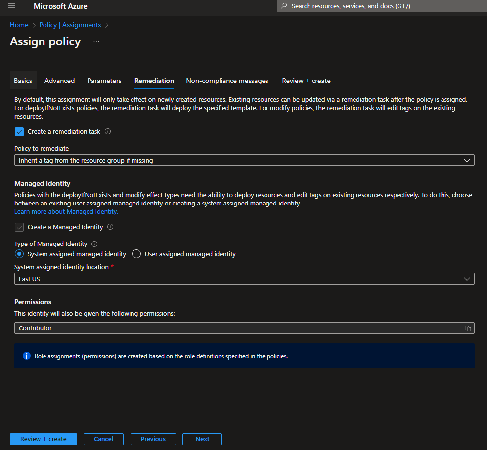

9- Haga clic en Revisar + Crear y, a continuación, en Crear.

10- Vuelva a la hoja del grupo de recursos que aloja la cuenta de almacenamiento utilizada para la unidad principal de Cloud Shell, que identificó en la primera tarea.

11- En la hoja del grupo de recursos, haga clic en + Crear, busque Cuenta de almacenamiento y haga clic en + Crear.

12- En la pestaña Conceptos básicos de la hoja Crear cuenta de almacenamiento, compruebe que está utilizando el grupo de recursos al que se aplicó la política y especifique los siguientes parámetros (deje los demás con sus valores predeterminados) y haga clic en Revisar + crear:

| Setting              | Value                                                                                                     |
|----------------------|-----------------------------------------------------------------------------------------------------------|
| Storage account name | any globally unique combination of between 3 and 24 lower case letters and digits, starting with a letter |

13- Compruebe que esta vez la validación se ha superado y haga clic en Crear.

14- Una vez aprovisionada la nueva cuenta de almacenamiento, haga clic en el botón Ir al recurso y, en la hoja Descripción general de la cuenta de almacenamiento recién creada, observe que la etiqueta Rol con el valor Infra se ha asignado automáticamente al recurso.

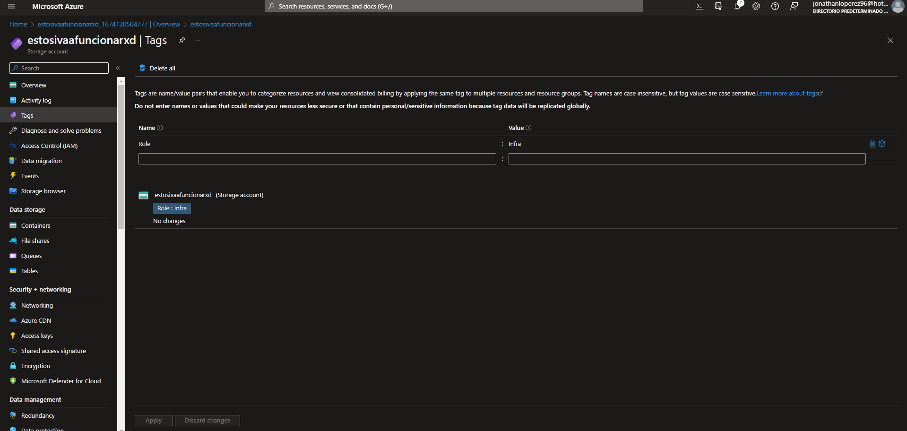
