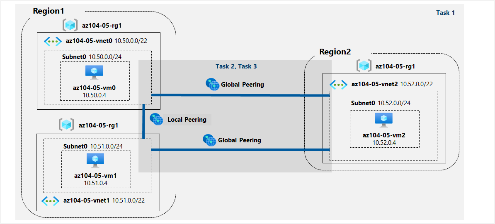

# LAB5 - Implantar la conectividad entre sitios

Contoso tiene sus centros de datos en las oficinas de Boston, Nueva York y Seattle conectados a través de una malla de enlaces de red de área amplia, con conectividad completa entre ellos. Necesita implementar un entorno de laboratorio que refleje la topología de las redes locales de Contoso y verificar su funcionalidad.

## Tarea 1: Aprovisionar el entorno de laboratorio

1- Inicie sesión en el portal Azure.

2- En el portal Azure, abra Azure Cloud Shell haciendo clic en el icono de la parte superior derecha del portal Azure.

3- Si se le pide que seleccione Bash o PowerShell, seleccione PowerShell.

4- En la barra de herramientas del panel de Cloud Shell, haga clic en el icono Cargar/Descargar archivos; en el menú desplegable, haga clic en Cargar y cargue los archivos \Allfiles\Labs\05\az104-05-vnetvm-loop-template.json y \Allfiles\Labs\05\az104-05-vnetvm-loop-parameters.json en el directorio principal de Cloud Shell.

5- Edite el archivo Parameters que acaba de cargar y cambie la contraseña. Si necesita ayuda para editar el archivo en Shell, pida ayuda a su instructor. Como práctica recomendada, los secretos, como las contraseñas, deberían almacenarse de forma más segura en la Bóveda de claves.

6- Desde el panel de Shell Cloud, ejecute lo siguiente para crear el grupo de recursos que alojará el entorno de laboratorio. Las dos primeras redes virtuales y un par de máquinas virtuales se desplegarán en [Azure_region_1]. La tercera red virtual y la tercera máquina virtual se desplegarán en el mismo grupo de recursos pero en otro [Azure_region_2]. (sustituye el marcador de posición [Azure_region_1] y [Azure_region_2], incluidos los corchetes, por los nombres de dos regiones Azure diferentes en las que pretendas desplegar estas máquinas virtuales Azure. Un ejemplo es $location1 = 'eastus'. Puede utilizar Get-AzLocation para obtener una lista de todas las ubicaciones):

`$location1 = 'eastus'`

`$location2 = 'westus'`

`$rgName = 'az104-05-rg1'`

`New-AzResourceGroup -Name $rgName -Location $location1`

7- Desde el panel Cloud Shell, ejecute lo siguiente para crear las tres redes virtuales y desplegar máquinas virtuales en ellas utilizando la plantilla y los archivos de parámetros que cargó:

`New-AzResourceGroupDeployment -ResourceGroupName $rgName -TemplateFile $HOME/az104-05-vnetvm-loop-template.json -TemplateParameterFile $HOME/az104-05-vnetvm-loop-parameters.json -location1 $location1 -location2 $location2`

8- Cierre el panel de Cloud Shell.

## Tarea 2: Configurar la interconexión local y global de redes virtuales

1- En el portal Azure, busque y seleccione Redes virtuales.

2- Revise las redes virtuales que creó en la tarea anterior y compruebe que las dos primeras se encuentran en la misma región de Azure y la tercera en una región de Azure diferente.

3- En la lista de redes virtuales, haga clic en az104-05-vnet0.

4- En la hoja de red virtual az104-05-vnet0, en la sección Settings, haga clic en Peerings y, a continuación, haga clic en + Add.

5- Añada un peering con la siguiente configuración (deje los demás con sus valores predeterminados) y haga clic en Añadir:

| Setting                                                             | Value                                                           |
|---------------------------------------------------------------------|-----------------------------------------------------------------|
| This virtual network: Peering link name                             | az104-05-vnet0_to_az104-05-vnet1                                |
| This virtual network: Traffic to remote virtual network             | Allow (default)                                                 |
| This virtual network: Traffic forwarded from remote virtual network | Block traffic that originates from outside this virtual network |
| Virtual network gateway                                             | None                                                            |
| Remote virtual network: Peering link name                           | az104-05-vnet1_to_az104-05-vnet0                                |
| Virtual network deployment model                                    | Resource manager                                                |
| I know my resource ID                                               | unselected                                                      |
| Subscription                                                        | the name of the Azure subscription you are using in this lab    |
| Virtual network                                                     | az104-05-vnet1                                                  |
| Traffic to remote virtual network                                   | Allow (default)                                                 |
| Traffic forwarded from remote virtual network                       | Block traffic that originates from outside this virtual network |
| Virtual network gateway                                             | None                                                            |

`$rgName = 'az104-05-rg1'`

`$vnet0 = Get-AzVirtualNetwork -Name 'az104-05-vnet0' -ResourceGroupName $rgname`

`$vnet1 = Get-AzVirtualNetwork -Name 'az104-05-vnet1' -ResourceGroupName $rgname`

`Add-AzVirtualNetworkPeering -Name 'az104-05-vnet0_to_az104-05-vnet1' -VirtualNetwork $vnet0 -RemoteVirtualNetworkId $vnet1.Id`

`Add-AzVirtualNetworkPeering -Name 'az104-05-vnet1_to_az104-05-vnet0' -VirtualNetwork $vnet1 -RemoteVirtualNetworkId $vnet0.Id`

6- En el blade de red virtual az104-05-vnet0, en la sección Settings, haga clic en Peerings y, a continuación, en + Add.

7- Añada un peering con la siguiente configuración (deje los demás valores por defecto) y haga clic en Añadir:

| Setting                                                             | Value                                                           |
|---------------------------------------------------------------------|-----------------------------------------------------------------|
| This virtual network: Peering link name                             | az104-05-vnet0_to_az104-05-vnet2                                |
| This virtual network: Traffic to remote virtual network             | Allow (default)                                                 |
| This virtual network: Traffic forwarded from remote virtual network | Block traffic that originates from outside this virtual network |
| Virtual network gateway                                             | None                                                            |
| Remote virtual network: Peering link name                           | az104-05-vnet2_to_az104-05-vnet0                                |
| Virtual network deployment model                                    | Resource manager                                                |
| I know my resource ID                                               | unselected                                                      |
| Subscription                                                        | the name of the Azure subscription you are using in this lab    |
| Virtual network                                                     | az104-05-vnet2                                                  |
| Traffic to remote virtual network                                   | Allow (default)                                                 |
| Traffic forwarded from remote virtual network                       | Block traffic that originates from outside this virtual network |
| Virtual network gateway                                             | None                                                            |

`$rgName = 'az104-05-rg1'`

`$vnet0 = Get-AzVirtualNetwork -Name 'az104-05-vnet0' -ResourceGroupName $rgname`

`$vnet2 = Get-AzVirtualNetwork -Name 'az104-05-vnet2' -ResourceGroupName $rgname`

`Add-AzVirtualNetworkPeering -Name 'az104-05-vnet0_to_az104-05-vnet2' -VirtualNetwork $vnet0 -RemoteVirtualNetworkId $vnet2.Id`

`Add-AzVirtualNetworkPeering -Name 'az104-05-vnet2_to_az104-05-vnet0' -VirtualNetwork $vnet2 -RemoteVirtualNetworkId $vnet0.Id`

8- Vuelva al blade Redes virtuales y, en la lista de redes virtuales, haga clic en az104-05-vnet1.

9- En el blade de red virtual az104-05-vnet1, en la sección Configuración, haga clic en Peerings y, a continuación, en + Añadir.

10- Añada un peering con la siguiente configuración (deje los demás valores por defecto) y haga clic en Añadir:

| Setting                                                             | Value                                                           |
|---------------------------------------------------------------------|-----------------------------------------------------------------|
| This virtual network: Peering link name                             | az104-05-vnet1_to_az104-05-vnet2                                |
| This virtual network: Traffic to remote virtual network             | Allow (default)                                                 |
| This virtual network: Traffic forwarded from remote virtual network | Block traffic that originates from outside this virtual network |
| Virtual network gateway                                             | None                                                            |
| Remote virtual network: Peering link name                           | az104-05-vnet2_to_az104-05-vnet1                                |
| Virtual network deployment model                                    | Resource manager                                                |
| I know my resource ID                                               | unselected                                                      |
| Subscription                                                        | the name of the Azure subscription you are using in this lab    |
| Virtual network                                                     | az104-05-vnet2                                                  |
| Traffic to remote virtual network                                   | Allow (default)                                                 |
| Traffic forwarded from remote virtual network                       | Block traffic that originates from outside this virtual network |
| Virtual network gateway                                             | None                                                            |

`$rgName = 'az104-05-rg1'`

`$vnet1 = Get-AzVirtualNetwork -Name 'az104-05-vnet1' -ResourceGroupName $rgname`

`$vnet2 = Get-AzVirtualNetwork -Name 'az104-05-vnet2' -ResourceGroupName $rgname`

`Add-AzVirtualNetworkPeering -Name 'az104-05-vnet1_to_az104-05-vnet2' -VirtualNetwork $vnet1 -RemoteVirtualNetworkId $vnet2.Id`

`Add-AzVirtualNetworkPeering -Name 'az104-05-vnet2_to_az104-05-vnet1' -VirtualNetwork $vnet2 -RemoteVirtualNetworkId $vnet1.Id`

## Tarea 3: Probar la conectividad entre sitios

1- En el portal Azure, busque y seleccione Máquinas virtuales.

2- En la lista de máquinas virtuales, haga clic en az104-05-vm0.

3- En el blade az104-05-vm0, haga clic en Conectar, en el menú desplegable, haga clic en RDP, en el blade Conectar con RDP, haga clic en Descargar archivo RDP y siga las indicaciones para iniciar la sesión de Escritorio remoto.

4- Cuando se le solicite, inicie sesión utilizando el nombre de usuario de Estudiante y la contraseña de su archivo de parámetros.

> Usuario y contraseña: Student Pa55w.rd1234

5- Dentro de la sesión de Escritorio Remoto a az104-05-vm0, haga clic con el botón derecho en el botón Inicio y, en el menú del botón derecho, haga clic en Windows PowerShell (Admin).

6- En la ventana de la consola de Windows PowerShell, ejecute lo siguiente para probar la conectividad con az104-05-vm1 (que tiene la dirección IP privada de 10.51.0.4) a través del puerto TCP 3389:

`Test-NetConnection -ComputerName 10.51.0.4 -Port 3389 -InformationLevel Detailed`

7- Examine la salida del comando y compruebe que la conexión se ha realizado correctamente.

8- En la ventana de la consola de Windows PowerShell, ejecute lo siguiente para probar la conectividad con az104-05-vm2 (que tiene la dirección IP privada de 10.52.0.4):

`Test-NetConnection -ComputerName 10.52.0.4 -Port 3389 -InformationLevel Detailed`

9- Vuelva al portal Azure en su ordenador de laboratorio y navegue de nuevo a la hoja Máquinas virtuales.

10- En la lista de máquinas virtuales, haga clic en az104-05-vm1.

11- En la hoja az104-05-vm1, haga clic en Conectar, en el menú desplegable, haga clic en RDP, en la hoja Conectar con RDP, haga clic en Descargar archivo RDP y siga las instrucciones para iniciar la sesión de Escritorio remoto.

12- Cuando se le solicite, inicie sesión utilizando el nombre de usuario de Estudiante y la contraseña de su archivo de parámetros.

> Usuario y contraseña: Student Pa55w.rd1234

13- Dentro de la sesión de Escritorio Remoto a az104-05-vm1, haga clic con el botón derecho en el botón Inicio y, en el menú del botón derecho, haga clic en Windows PowerShell (Admin).

14- En la ventana de la consola de Windows PowerShell, ejecute lo siguiente para probar la conectividad con az104-05-vm2 (que tiene la dirección IP privada de 10.52.0.4) a través del puerto TCP 3389:

`Test-NetConnection -ComputerName 10.52.0.4 -Port 3389 -InformationLevel Detailed`

15- Examine la salida del comando y compruebe que la conexión se ha realizado correctamente.

