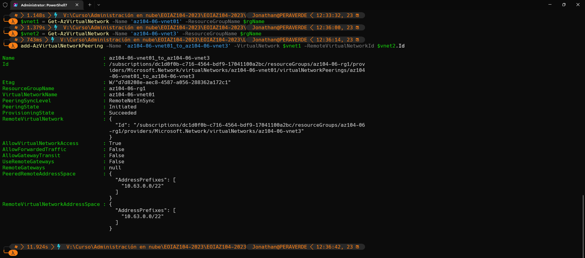

# Aplicar la gestión del tráfico

Se le encargó probar la gestión del tráfico de red dirigido a máquinas virtuales Azure en la topología de red hub and spoke, que Contoso considera implementar en su entorno Azure (en lugar de crear la topología de malla, que probó en el laboratorio anterior). Esta prueba debe incluir la implementación de la conectividad entre los radios basándose en rutas definidas por el usuario que obliguen al tráfico a fluir a través del concentrador, así como la distribución del tráfico entre las máquinas virtuales mediante el uso de equilibradores de carga de capa 4 y capa 7. Para ello, se pretende utilizar Azure Load Balancer (capa 4) y Azure Application Gateway (capa 7).

## Tarea 1: Aprovisionar el entorno de laboratorio

1- Inicie sesión en el portal Azure.

2- En el portal Azure, abra Azure Cloud Shell haciendo clic en el icono de la parte superior derecha del portal Azure.

3- Si se le pide que seleccione Bash o PowerShell, seleccione PowerShell.

4- En la barra de herramientas del panel de Cloud Shell, haga clic en el icono Cargar/Descargar archivos; en el menú desplegable, haga clic en Cargar y cargue los archivos \Allfiles\Labs\06\az104-06-vms-loop-template.json y \Allfiles\Labs\06\az104-06-vms-loop-parameters.json en el directorio principal de Cloud Shell.

5- Edite el archivo Parámetros que acaba de cargar y cambie la contraseña. Si necesita ayuda para editar el archivo en Shell, pida ayuda a su instructor. Como práctica recomendada, los secretos, como las contraseñas, deberían almacenarse de forma más segura en la Bóveda de claves.

6- En el panel Shell de la nube, ejecute lo siguiente para crear el primer grupo de recursos que alojará el entorno de laboratorio (sustituya el marcador de posición '[Azure_region]' por el nombre de una región de Azure en la que desee desplegar máquinas virtuales Azure) (puede utilizar el cmdlet "(Get-AzLocation).Location" para obtener la lista de regiones):

`$location = '[Azure_region]'`

Ahora el nombre del grupo de recursos:

`$rgName = 'az104-06-rg1'`

Y por último crea el grupo de recursos en la ubicación que desees:

`New-AzResourceGroup -Name $rgName -Location $location`

7- Desde el panel Cloud Shell, ejecuta lo siguiente para crear las tres redes virtuales y cuatro máquinas virtuales Azure en ellas utilizando la plantilla y los archivos de parámetros que subiste:

`New-AzResourceGroupDeployment -ResourceGroupName $rgName -TemplateFile $HOME/az104-06-vms-loop-template.json -TemplateParameterFile $HOME/az104-06-vms-loop-parameters.json`

8- Desde el panel Cloud Shell, ejecuta lo siguiente para instalar la extensión Network Watcher en las VMs Azure desplegadas en el paso anterior:

`$rgName = 'az104-06-rg1'`  
`$location = (Get-AzResourceGroup -ResourceGroupName $rgName).location`  
`$vmNames = (Get-AzVM -ResourceGroupName $rgName).Name`  

>foreach ($vmName in $vmNames) { Set-AzVMExtension -ResourceGroupName $rgName -Location $location -VMName $vmName -Name 'networkWatcherAgent' -Publisher 'Microsoft.Azure.NetworkWatcher' -Type 'NetworkWatcherAgentWindows'   -TypeHandlerVersion '1.4'}

9- Cierra el panel de Cloud Shell.

## Tarea 2: Configurar la topología de red hub y spoke

1- En el portal Azure, busque y seleccione Redes virtuales.

2- Revise las redes virtuales que creó en la tarea anterior.

3- En la lista de redes virtuales, seleccione az104-06-vnet2.

4- En el blade az104-06-vnet2, seleccione Propiedades.

5- En el aspa az104-06-vnet2 | Propiedades, registre el valor de la propiedad ID de recurso.

6- Vuelva a la lista de redes virtuales y seleccione az104-06-vnet3.

7- En la hoja az104-06-vnet3, seleccione Propiedades.

8- En el aspa az104-06-vnet3 | Propiedades, registre el valor de la propiedad ID de Recurso.

9- En la lista de redes virtuales, haga clic en az104-06-vnet01.

10- En el blade de red virtual az104-06-vnet01, en la sección Configuración, haga clic en Peerings y, a continuación, en + Añadir.

11- Añada un peering con la siguiente configuración (deje los demás valores por defecto) y haga clic en Añadir:

| Setting                                       | Value                                                                                 |
|-----------------------------------------------|---------------------------------------------------------------------------------------|
| This virtual network: Peering link name       | az104-06-vnet01_to_az104-06-vnet2                                                     |
| Traffic to remote virtual network             | Allow (default)                                                                       |
| Traffic forwarded from remote virtual network | Block traffic that originates from outside this virtual network                       |
| Virtual network gateway                       | None (default)                                                                        |
| Remote virtual network: Peering link name     | az104-06-vnet2_to_az104-06-vnet01                                                     |
| Virtual network deployment model              | Resource manager                                                                      |
| I know my resource ID                         | enabled                                                                               |
| Resource ID                                   | the value of resourceID parameter of az104-06-vnet2 you recorded earlier in this task |
| Traffic to remote virtual network             | Allow (default)                                                                       |
| Traffic forwarded from remote virtual network | Allow (default)                                                                       |
| Virtual network gateway                       | None (default)                                                                        |

12- En el blade de red virtual az104-06-vnet01, en la sección Settings, haga clic en Peerings y, a continuación, en + Add.

13- Añada un peering con la siguiente configuración (deje los demás valores por defecto) y haga clic en Añadir:

| Setting                                       | Value                                                                                 |
|-----------------------------------------------|---------------------------------------------------------------------------------------|
| This virtual network: Peering link name       | az104-06-vnet01_to_az104-06-vnet3                                                     |
| Traffic to remote virtual network             | Allow (default)                                                                       |
| Traffic forwarded from remote virtual network | Block traffic that originates from outside this virtual network                       |
| Virtual network gateway                       | None (default)                                                                        |
| Remote virtual network: Peering link name     | az104-06-vnet3_to_az104-06-vnet01                                                     |
| Virtual network deployment model              | Resource manager                                                                      |
| I know my resource ID                         | enabled                                                                               |
| Resource ID                                   | the value of resourceID parameter of az104-06-vnet3 you recorded earlier in this task |
| Traffic to remote virtual network             | Allow (default)                                                                       |
| Traffic forwarded from remote virtual network | Allow (default)                                                                       |
| Virtual network gateway                       | None (default)                                                                        |

## Tarea 3: Probar la transitividad de la interconexión de redes virtuales

1- En el portal de Azure, busque y seleccione Network Watcher.

2- En la hoja de Network Watcher, expanda la lista de regiones de Azure y verifique que el servicio esté habilitado en la región que está utilizando.

3- En la hoja de Network Watcher, navegue hasta Connection troubleshoot (Solución de problemas de conexión).

4- En Network Watcher - Connection troubleshoot blade, inicie una comprobación con los siguientes parámetros (deje los demás con sus valores predeterminados):

| Setting           | Value                                                        |
|-------------------|--------------------------------------------------------------|
| Subscription      | the name of the Azure subscription you are using in this lab |
| Resource group    | az104-06-rg1                                                 |
| Source type       | Virtual machine                                              |
| Virtual machine   | az104-06-vm0                                                 |
| Destination       | Specify manually                                             |
| URI, FQDN or IPv4 | 10.62.0.4                                                    |
| Protocol          | TCP                                                          |
| Destination Port  | 3389                                                         |

5- Haga clic en Comprobar y espere hasta que se devuelvan los resultados de la comprobación de conectividad. Compruebe que el estado es Alcanzable. Revise la ruta de red y compruebe que la conexión es directa, sin saltos intermedios entre las máquinas virtuales.

6- En Network Watcher - Connection troubleshoot blade, inicie una comprobación con los siguientes parámetros (deje los demás con sus valores predeterminados):

| Setting           | Value                                                        |
|-------------------|--------------------------------------------------------------|
| Subscription      | the name of the Azure subscription you are using in this lab |
| Resource group    | az104-06-rg1                                                 |
| Source type       | Virtual machine                                              |
| Virtual machine   | az104-06-vm0                                                 |
| Destination       | Specify manually                                             |
| URI, FQDN or IPv4 | 10.63.0.4                                                    |
| Protocol          | TCP                                                          |
| Destination Port  | 3389                                                         |

7- Haga clic en Comprobar y espere hasta que se devuelvan los resultados de la comprobación de conectividad. Compruebe que el estado es Alcanzable. Revise la ruta de red y observe que la conexión fue directa, sin saltos intermedios entre las máquinas virtuales.

8- En Network Watcher - Connection troubleshoot blade, inicie una comprobación con los siguientes parámetros (deje los demás con sus valores predeterminados):

| Setting           | Value                                                        |
|-------------------|--------------------------------------------------------------|
| Subscription      | the name of the Azure subscription you are using in this lab |
| Resource group    | az104-06-rg1                                                 |
| Source type       | Virtual machine                                              |
| Virtual machine   | az104-06-vm2                                                 |
| Destination       | Specify manually                                             |
| URI, FQDN or IPv4 | 10.63.0.4                                                    |
| Protocol          | TCP                                                          |
| Destination Port  | 3389                                                         |

9- Haga clic en Comprobar y espere hasta que se devuelvan los resultados de la comprobación de conectividad. Observe que el estado es Inalcanzable.

## Tarea 4: Configurar el enrutamiento en la topología hub and spoke

1- En el portal Azure, busque y seleccione Máquinas virtuales.

2- En el blade Máquinas virtuales, en la lista de máquinas virtuales, haga clic en az104-06-vm0.

3- En el blade de la máquina virtual az104-06-vm0, en la sección Configuración, haga clic en Redes.

4- Haga clic en el enlace az104-06-nic0 junto a la etiqueta Interfaz de red y, a continuación, en el blade de interfaz de red az104-06-nic0, en la sección Configuración, haga clic en Configuraciones IP.

5- Establezca Reenvío de IP en Activado y guarde el cambio.

6- En el portal Azure, vuelva al blade de máquina virtual Azure az104-06-vm0 y haga clic en Overview.

7- En el blade az104-06-vm0, en la sección Operaciones, haga clic en Ejecutar comando y, en la lista de comandos, haga clic en RunPowerShellScript.

8- En el blade Run Command Script, escriba lo siguiente y haga clic en Run para instalar el rol Remote Access Windows Server.

`Install-WindowsFeature RemoteAccess -IncludeManagementTools`

9- En el blade Ejecutar script de comandos, escriba lo siguiente y haga clic en Ejecutar para instalar el servicio del rol Enrutamiento.

`Install-WindowsFeature -Name Routing -IncludeManagementTools -IncludeAllSubFeature`

`Install-WindowsFeature -Name "RSAT-RemoteAccess-Powershell"`

`Install-RemoteAccess -VpnType RoutingOnly`

`Get-NetAdapter | Set-NetIPInterface -Forwarding Enabled`

10- En el portal Azure, busque y seleccione Tablas de rutas y, en el blade Tablas de rutas, haga clic en + Crear.

11- Cree una tabla de rutas con la siguiente configuración (deje las demás con sus valores predeterminados):

| Setting                  | Value                                                                  |
|--------------------------|------------------------------------------------------------------------|
| Subscription             | the name of the Azure subscription you are using in this lab           |
| Resource group           | az104-06-rg1                                                           |
| Location                 | the name of the Azure region in which you created the virtual networks |
| Name                     | az104-06-rt23                                                          |
| Propagate gateway routes | No                                                                     |

12- Haga clic en Revisar y Crear. Deje que se produzca la validación y haga clic en Crear para enviar la implementación.

13- Haga clic en Ir al recurso.

14- En la hoja de tabla de rutas az104-06-rt23, en la sección Configuración, haga clic en Rutas y, a continuación, en + Añadir.

15- Añada una nueva ruta con la siguiente configuración:

| Setting                              | Value                         |
|--------------------------------------|-------------------------------|
| Route name                           | az104-06-route-vnet2-to-vnet3 |
| Address prefix destination           | IP Addresses                  |
| Destination IP addresses/CIDR ranges | 10.63.0.0/20                  |
| Next hop type                        | Virtual appliance             |
| Next hop address                     | 10.60.0.4                     |

16- Haga clic en Añadir

17- De nuevo en la hoja de tabla de rutas az104-06-rt23, en la sección Configuración, haga clic en Subredes y, a continuación, en + Asociar.

18- Asocie la tabla de rutas az104-06-rt23 con la siguiente subred:

| Setting         | Value          |
|-----------------|----------------|
| Virtual network | az104-06-vnet2 |
| Subnet          | subnet0        |

19- Haga clic en Agregar

20- Vuelva a la hoja Tablas de rutas y haga clic en + Crear.

21- Cree una tabla de rutas con la siguiente configuración (deje los demás valores por defecto):

| Setting                  | Value                                                                  |
|--------------------------|------------------------------------------------------------------------|
| Subscription             | the name of the Azure subscription you are using in this lab           |
| Resource group           | az104-06-rg1                                                           |
| Region                   | the name of the Azure region in which you created the virtual networks |
| Name                     | az104-06-rt32                                                          |
| Propagate gateway routes | No                                                                     |

22- Haga clic en Revisar y Crear. Deje que se produzca la validación y pulse Crear para enviar su despliegue.

23- Haga clic en Ir al recurso.

24- En la hoja de tabla de rutas az104-06-rt32, en la sección Configuración, haga clic en Rutas y, a continuación, en + Añadir.

25- Añada una nueva ruta con la siguiente configuración:

| Setting                              | Value                         |
|--------------------------------------|-------------------------------|
| Route name                           | az104-06-route-vnet3-to-vnet2 |
| Address prefix destination           | IP Addresses                  |
| Destination IP addresses/CIDR ranges | 10.62.0.0/20                  |
| Next hop type                        | Virtual appliance             |
| Next hop address                     | 10.60.0.4                     |

26- Haga clic en OK

27- De nuevo en la hoja de tabla de rutas az104-06-rt32, en la sección Configuración, haga clic en Subredes y, a continuación, en + Asociar.

28- Asocie la tabla de rutas az104-06-rt32 con la siguiente subred:

| Setting         | Value          |
|-----------------|----------------|
| Virtual network | az104-06-vnet3 |
| Subnet          | subnet0        |

29- Haga clic en OK

30- En el portal Azure, navegue de nuevo a la hoja Network Watcher - Connection troubleshoot.

31- En Network Watcher - Connection troubleshoot blade, inicie una comprobación con los siguientes parámetros (deje los demás con sus valores predeterminados):

| Setting           | Value                                                        |
|-------------------|--------------------------------------------------------------|
| Subscription      | the name of the Azure subscription you are using in this lab |
| Resource group    | az104-06-rg1                                                 |
| Source type       | Virtual machine                                              |
| Virtual machine   | az104-06-vm2                                                 |
| Destination       | Specify manually                                             |
| URI, FQDN or IPv4 | 10.63.0.4                                                    |
| Protocol          | TCP                                                          |
| Destination Port  | 3389                                                         |

32- Haga clic en Comprobar y espere hasta que se devuelvan los resultados de la comprobación de conectividad. Compruebe que el estado es Alcanzable. Revise la ruta de red y observe que el tráfico se enrutó a través de 10.60.0.4, asignado al adaptador de red az104-06-nic0. Si el estado es Inalcanzable, debe detener y luego iniciar az104-06-vm0.

`Si es inalcanzable compruebe los enrutamientos para que permitan el tráfico.`

## Tarea 5: Implementar Azure Load Balancer

1- En el portal Azure, busque y seleccione Balanceadores de carga y, en la hoja Balanceadores de carga, haga clic en + Crear.

2- Cree un equilibrador de carga con los siguientes ajustes (deje los demás con sus valores predeterminados) y, a continuación, haga clic en Siguiente : Configuración de IP de frontend:

| Setting        | Value                                                                            |
|----------------|----------------------------------------------------------------------------------|
| Subscription   | the name of the Azure subscription you are using in this lab                     |
| Resource group | az104-06-rg4                                                                     |
| Name           | az104-06-lb4                                                                     |
| Region         | name of the Azure region into which you deployed all other resources in this lab |
| SKU            | Standard                                                                         |
| Type           | Public                                                                           |
| Tier           | Regional                                                                         |

3- En la pestaña Frontend IP configuration, haga clic en Add a frontend IP configuration y utilice la siguiente configuración antes de hacer clic en OK y luego en Add. Cuando haya terminado, haga clic en Siguiente: Backend pools.

| Setting           | Value         |
|-------------------|---------------|
| Name              | az104-06-pip4 |
| IP version        | IPv4          |
| IP type           | IP address    |
| Public IP address | Create new    |
| Availability zone | No Zone       |

4- En la pestaña Backend pools, haga clic en Add a backend pool con la siguiente configuración (deje los demás valores por defecto). Haga clic en + Añadir (dos veces) y, a continuación, en Siguiente: Reglas de entrada.

| Setting                            | Value            |
|------------------------------------|------------------|
| Name                               | az104-06-lb4-be1 |
| Virtual network                    | az104-06-vnet01  |
| Backend Pool Configuration         | NIC              |
| IP Version                         | IPv4             |
| Click Add to add a virtual machine |                  |
| az104-06-vm0                       | check the box    |
| az104-06-vm1                       | check the box    |

5- En la pestaña Reglas de entrada, haga clic en Añadir una regla de equilibrio de carga. Añada una regla de equilibrio de carga con la siguiente configuración (deje los demás valores por defecto). Cuando haya terminado, haga clic en Añadir.

| Setting                                            | Value                |
|----------------------------------------------------|----------------------|
| Name                                               | az104-06-lb4-lbrule1 |
| IP Version                                         | IPv4                 |
| Frontend IP Address                                | az104-06-pip4        |
| Backend pool                                       | az104-06-lb4-be1     |
| Protocol                                           | TCP                  |
| Port                                               | 80                   |
| Backend port                                       | 80                   |
| Health probe                                       | Create new           |
| Name                                               | az104-06-lb4-hp1     |
| Protocol                                           | TCP                  |
| Port                                               | 80                   |
| Interval                                           | 5                    |
| Unhealthy threshold                                | 2                    |
| Close the create health probe window               | OK                   |
| Session persistence                                | None                 |
| Idle timeout (minutes)                             | 4                    |
| TCP reset                                          | Disabled             |
| Floating IP                                        | Disabled             |
| Outbound source network address translation (SNAT) | Recommended          |

6- Si dispone de tiempo, revise las demás pestañas y, a continuación, haga clic en Revisar y crear. Asegúrese de que no hay errores de validación y haga clic en Crear.

7- Espere a que se despliegue el equilibrador de carga y haga clic en Ir al recurso.

8- Seleccione Frontend IP configuration en la página de recursos del equilibrador de carga. Copie la dirección IP.

9- Abra otra pestaña del navegador y navegue hasta la dirección IP. Compruebe que la ventana del navegador muestra el mensaje Hola Mundo desde az104-06-vm0 o Hola Mundo desde az104-06-vm1.

10- Actualice la ventana para comprobar que el mensaje cambia a la otra máquina virtual. Esto demuestra que el equilibrador de carga rota a través de las máquinas virtuales.

## Tarea 6: Implementar Azure Application Gateway

1- En el portal Azure, busque y seleccione Redes virtuales.

2- En el blade Redes virtuales, en la lista de redes virtuales, haga clic en az104-06-vnet01.

3- En el blade de red virtual az104-06-vnet01, en la sección Configuración, haga clic en Subredes y, a continuación, en + Subred.

4- Añada una subred con la siguiente configuración (deje los demás valores por defecto):

| Setting              | Value          |
|----------------------|----------------|
| Name                 | subnet-appgw   |
| Subnet address range | 10.60.3.224/27 |

5- Haga clic en Guardar

6- En el portal Azure, busque y seleccione Application Gateways y, en la hoja Application Gateways, haga clic en + Crear.

7- En la ficha Conceptos básicos, especifique los siguientes parámetros (deje los demás con sus valores predeterminados):

| Setting                  | Value                                                                            |
|--------------------------|----------------------------------------------------------------------------------|
| Subscription             | the name of the Azure subscription you are using in this lab                     |
| Resource group           | az104-06-rg5 (create new)                                                        |
| Application gateway name | az104-06-appgw5                                                                  |
| Region                   | name of the Azure region into which you deployed all other resources in this lab |
| Tier                     | Standard V2                                                                      |
| Enable autoscaling       | No                                                                               |
| Instance count           | 2                                                                                |
| Availability zone        | None                                                                             |
| HTTP2                    | Disabled                                                                         |
| Virtual network          | az104-06-vnet01                                                                  |
| Subnet                   | subnet-appgw (10.60.3.224/27)                                                    |

8- Haga clic en Siguiente: Frontends > y especifique los siguientes ajustes (deje los demás con sus valores por defecto). Cuando haya terminado, haga clic en Aceptar.

| Setting                  | Value         |
|--------------------------|---------------|
| Frontend IP address type | Public        |
| Public IP address        | Add new       |
| Name                     | az104-06-pip5 |
| Availability zone        | None          |

9- Haga clic en Siguiente: Backends > y, a continuación, Añadir un grupo de backends. Especifique los siguientes parámetros (deje los demás con sus valores predeterminados). Cuando haya terminado, haga clic en Añadir.

| Setting                          | Value               |
|----------------------------------|---------------------|
| Name                             | az104-06-appgw5-be1 |
| Add backend pool without targets | No                  |
| IP address or FQDN               | 10.62.0.4           |
| IP address or FQDN               | 10.63.0.4           |

10- Haga clic en Siguiente: Configuración > y, a continuación, + Añadir una regla de enrutamiento. Especifique la siguiente configuración:

| Setting        | Value                 |
|----------------|-----------------------|
| Rule name      | az104-06-appgw5-rl1   |
| Priority       | 10                    |
| Listener name  | az104-06-appgw5-rl1l1 |
| Frontend IP    | Public                |
| Protocol       | HTTP                  |
| Port           | 80                    |
| Listener type  | Basic                 |
| Error page url | No                    |

11- Cambie a la pestaña Objetivos backend y especifique los siguientes parámetros (deje los demás con sus valores predeterminados). Cuando haya terminado, haga clic en Añadir (dos veces).

| Setting               | Value                 |
|-----------------------|-----------------------|
| Target type           | Backend pool          |
| Backend target        | az104-06-appgw5-be1   |
| Backend settings      | Add new               |
| Backend settings name | az104-06-appgw5-http1 |
| Backend protocol      | HTTP                  |
| Backend port          | 80                    |
| Additional settings   | take the defaults     |
| Host name             | take the defaults     |

12- Haga clic en Siguiente: Etiquetas >, seguido de Siguiente: Revisar + crear > y, a continuación, haga clic en Crear.

13- En el portal Azure, busque y seleccione Application Gateways y, en la hoja Application Gateways, haga clic en az104-06-appgw5.

14- En el blade az104-06-appgw5 Application Gateway, copie el valor de la dirección IP pública de Frontend.

15- Inicie otra ventana del navegador y navegue hasta la dirección IP que identificó en el paso anterior.

16- Compruebe que la ventana del navegador muestra el mensaje Hello World from az104-06-vm2 o Hello World from az104-06-vm3.

17- Actualice la ventana para verificar que el mensaje cambia a la otra máquina virtual.

